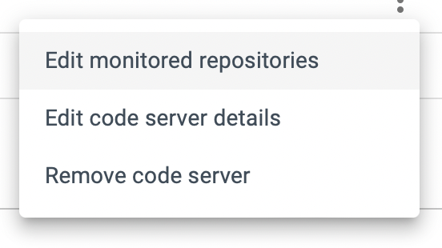
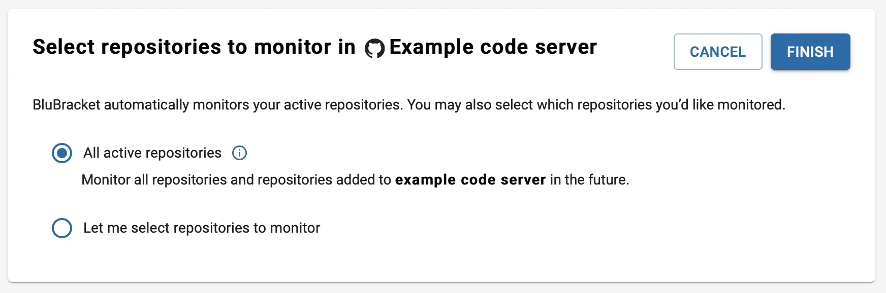

To monitor a code repository in BluBracket, it must be part of a monitored code server.

👉 [How to add code servers](https://docs.blubracket.com/how-to/add-code-servers/)

For many code servers supported by BluBracket, you have an option of automatically monitoring all repos on the code server, or choosing which repos to monitor. View your configured code servers in Settings → Code Servers, then select "edit monitored repositories" from the options menu for the code server: 

From there, choose which repositories to monitor:

