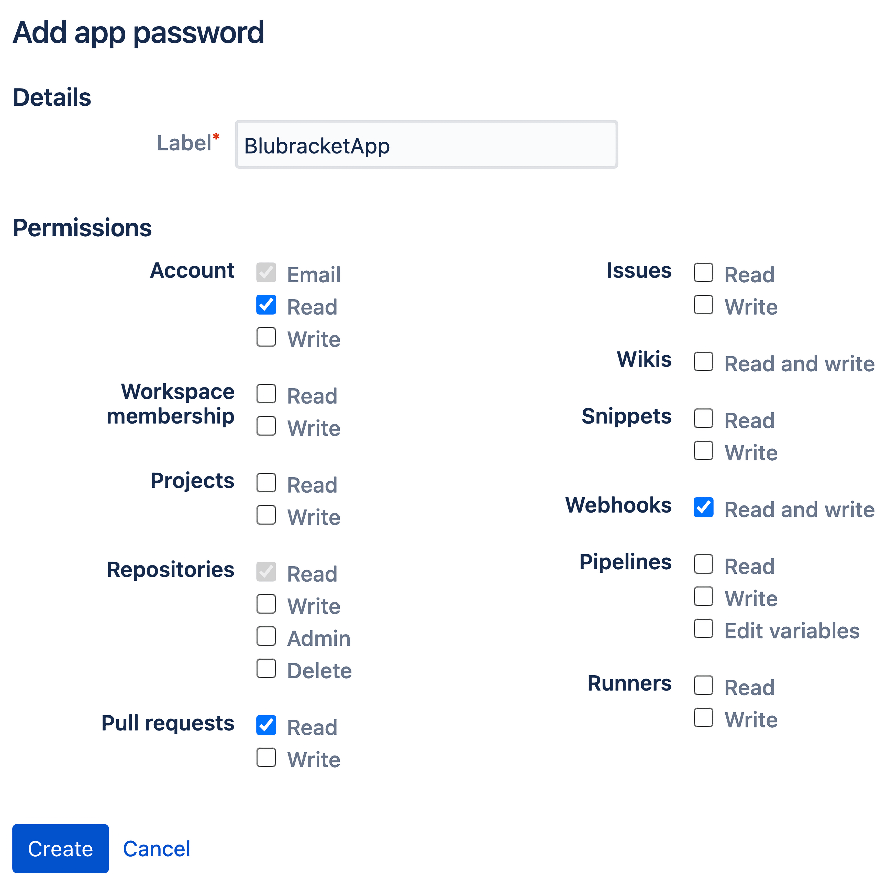

In order for BluBracket to access information within a given repository, an App Password (Bitbucket Cloud) or Personal Access Token (Bitbucket Server) must be uploaded into the tenant.  An administrator for the Bitbucket account can create a new password or token by taking the following steps:

#### Bitbucket Cloud {#cloud}

* For Bitbucket Cloud, once logged in to Bitbucket select Personal Settings → App Passwords. You should end up at a URL similar to the following:   https://bitbucket.org/account/settings/app-passwords/

* Select Create app password

* Provide a label

* Select the following permissions

#### Bitbucket server {#server}

* For Bitbucket Server, once logged into the Bitbucket interface, select Manage Account → Personal access tokens. You should end up at a URL similar to the following:   https://serverURL /plugins/servlet/access-tokens/manage

* Select Create a token

* Provide a Token name

* Select the following permissions

