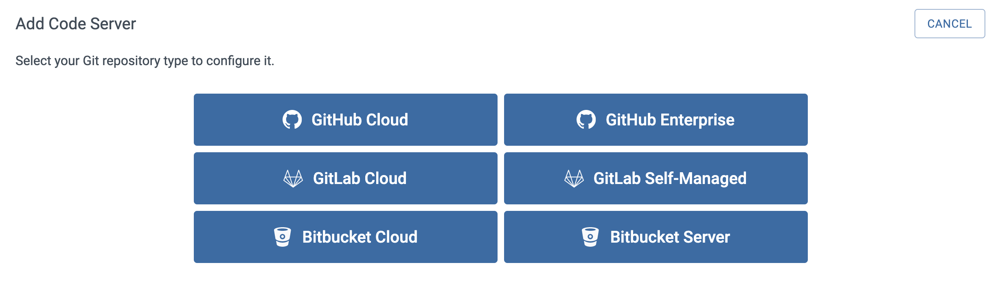

The first step in setting up a BluBracket tenant is adding your code servers.  This enables the BluBracket servers to communicate with your companies Bitbucket services, which are necessary to generate alerts/events and reports.  In this document, we will walk through the necessary steps to successfully add your Bitbucket enterprise code server to BluBracket. The following is a breakdown of the steps:

1. Navigating to the Enterprise Code Servers section of the Settings page

2. Selecting a Server Type

3. Entering a Workspace Name

4. Entering a Token and Creating a Bitbucket Personal Access Token

##### Navigating to the Enterprise Code Servers section of the Settings page**

Adding an Enterprise Code Server starts with navigating to the appropriate section in the Settings section of the tenant portal.  After authenticating into the portal, select the Settings option in the left navigation bar.

Once the Setting section is exposed, select the “Enterprise code servers” section.  This will expose any code servers that have already been configured as well as the “Add Code Server” button for adding new code servers.  Click on the “Add Code Server” button to expose the configuration bar at the right of the page.

##### Selecting a Server Type**

Now that the configuration bar is exposed, the first thing we want to do is select a Server Type.  We will be setting up a Bitbucket Cloud server, so select the “Bitbucket Cloud” option.

##### Entering a Workspace name**

The next thing to do is select a workspace to point the server to.  Workspaces are usually, but not always, set up as lines of business or projects.  For example, Google may have workspaces for Nest, Android, Add Words, etc., all under the same server.  It is possible to point a server at multiple workspaces. Enter the targeted workspace into the input field.

If you don’t know the workspace name you can find them in the Bitbucket administrator portal.  Log into your Bitbucket account as an administrator and navigate to the following location, https://bitbucket.org/account/workspaces/.  From this location, click Manage (under Actions) for one of the workspaces, and note the Workspace ID

##### Entering a Personal Access Token (PAT)

The next step in adding the code server is adding the Personal Access Token (PAT). In order for BluBracket to access information within a given repository, an access token must be uploaded into the tenant.

**Note: The personal access token but be entered in the following format:**
**username:token**
Example: holland:Vgc9Kw8w5zQu58989Uxz

[How To Generate A Personal Access Token On Bitbucket](https://support.blubracket.com/hc/en-us/articles/4404687343124-How-to-Generate-an-App-Password-or-Personal-Access-Token-PAT-in-Bitbucket)

Enter the token in the location indicated below:

Finally, select either the “All Repositories” or “Customer Select Repositories” option and click on the Save button.

At this point, if you’ve completed all of the above steps and entered the information accurately, the Enterprise Code Server should be up and running and start to pull the desired data. Please note it can take anywhere from a few minutes to several hours for our system to finish analyzing your repositories. You can navigate to the ‘Repositories’ page to check the real-time scanning status.
