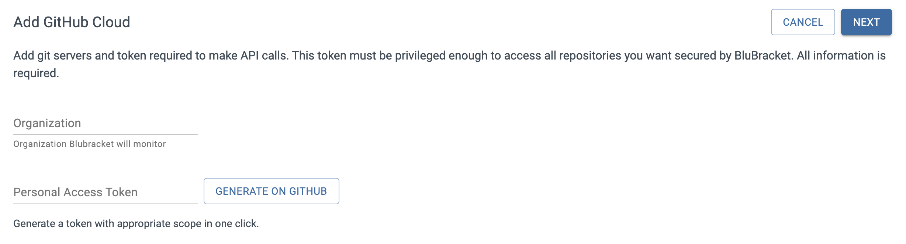
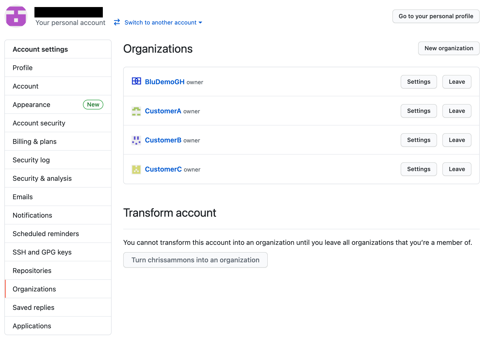
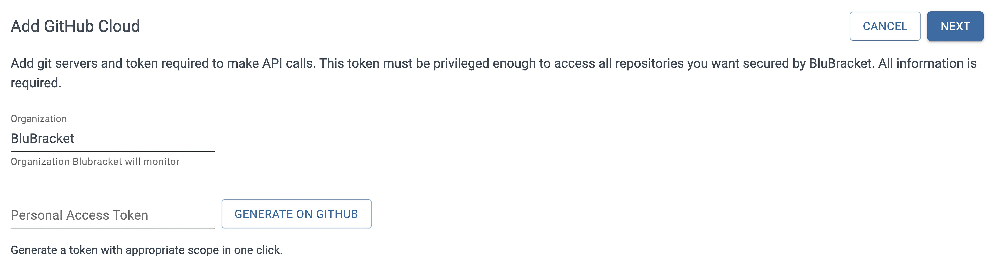
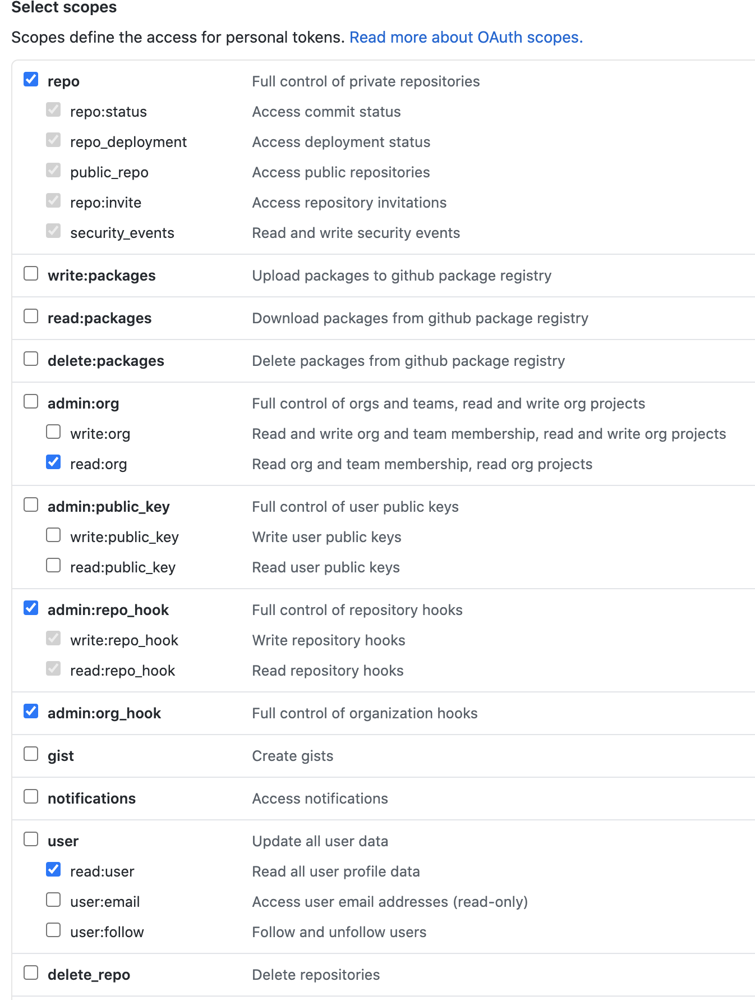
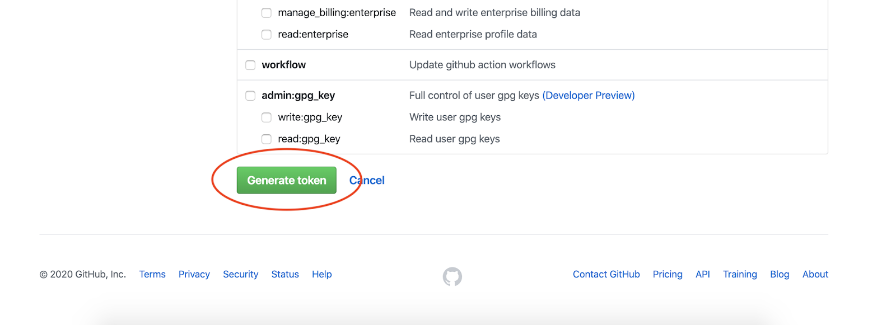
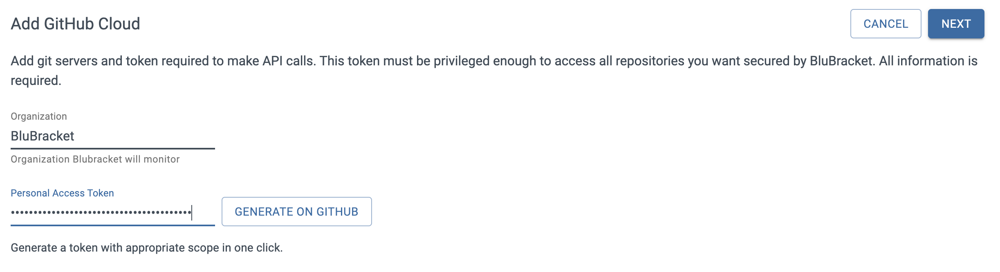
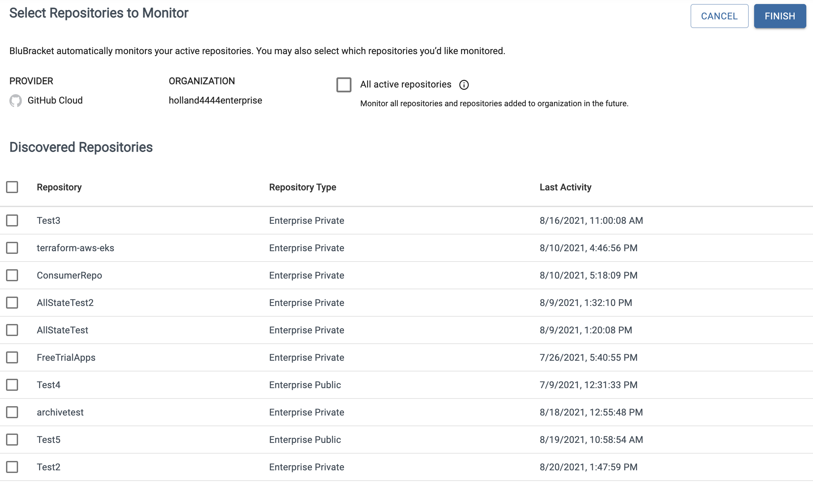

The first step in setting up a BluBracket tenant is adding your code servers.  This enables the BluBracket servers to communicate with your companies GitHub services, which are necessary to generate alerts/events and reports.  In this document, we will walk through the necessary steps to successfully add your GitHub enterprise code server to BluBracket. The following is a breakdown of the steps:

1. Navigating to the Enterprise Code Servers section of the Settings page

2. Selecting a Server Type

3. Entering an Organization and Locating GitHub Organizations

4. Entering a Token and Creating a GitHub Personal Access Token

###### Navigating to the Enterprise Code Servers section of the Settings page

Adding an Enterprise Code Server starts with navigating to the appropriate section in the Settings section of the tenant portal.  After authenticating into the portal, select the Settings option in the left navigation bar.

Once the Setting section is exposed, select the “Enterprise code servers” section.  This will expose any code servers that have already been configured as well as the “Add Code Server” button for adding new code servers.  Click on the “Add Code Server” button to expose the configuration bar at the right of the page.

###### Selecting a Server Type

Now that the configuration bar is exposed, the first thing we want to do is select a Server Type.  We will be setting up a GitHub Cloud server, so select the “GitHub Cloud” option.

###### Entering an Organization and Locating GitHub Organizations

The next thing to do is select an Organization to point the server to.  Organizations are usually, but not always, set up as lines of business or projects.  For example, Google may have Organizations for Nest, Android, Add Words, etc., all under the same server.  It is possible to point a server at multiple Organizations. Enter the targeted Organization into the input field.

If you don’t know the Organization name you can find them in the GitHub administrator portal.  Log into your GitHub account as an administrator and navigate to the following location: [https://github.com/settings/organizations.](https://github.com/settings/organizations)  From this location, it is possible to identify all of the Organizations used by that account.

###### Entering a Personal Access Token (PAT)

The next step in adding the code server is adding the Personal Access Token (PAT). In order for BluBracket to access information within a given repository, an access token must be uploaded into the tenant.  An administrator for the GitHub account can create a new token by clicking on the **Generate on GitHub button**

These are the permissions that the token must have for BluBracket to communicate correctly with the GitHub account:

Next, click on the “Generate token” button at the bottom of the page:

The token will now be availble to copy.  Enter the token in the location indicated below:

Finally, select either the “All Repositories” or “Customer Select Repositories” option and click on the Save button.

At this point, if you’ve completed all of the above steps and entered the information accurately, the Enterprise Code Server should be up and running and start to pull the desired data. Please note it can take anywhere from a few minutes to several hours for our system to finish analyzing your repositories. You can navigate to the ‘Repositories’ page to check the real-time scanning status.
