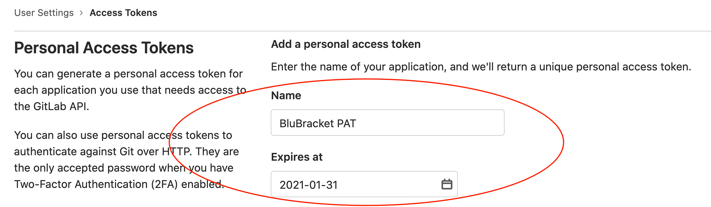

#### Entering a token and creating a GitLab personal access token

* In order for BluBracket to access information within a given repository, an access token must be uploaded into the tenant.  An administrator for the GitLab account can create a new token by taking the following steps:

* For GitLab Cloud, once logged into the GitLab interface, select Preferences → Access Tokens. You should end up at a URL similar to the following:   [https://gitlab.com/-/profile/personal_access_tokens](https://gitlab.com/-/profile/personal_access_tokens)

* For GitLab Self-Managed, once logged into the GitLab interface, select Preferences → Access Tokens. You should end up at a URL similar to the following: <enterprise-domain>/-/profile/personal_access_tokens

* Create a ‘Name’ for your PAT and an ‘Expiration Date’ as shown below:

* Select the following scopes:

* api

* read_api

These are the permissions that the token must have for BluBracket to communicate correctly with the GitLab account:

*See the notes at the bottom of the document for scope requirements.

* Click on the “Create personal access token” button at the bottom of the page.

* This token should now be available to copy.

#### Scope additional requirements

* For permissions, the user associated with the token has to be added as an org member.

* For the org, user can add themselves as an org to track repositories under their personal account.
