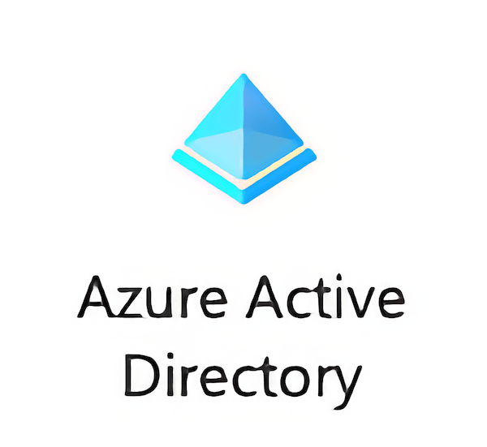
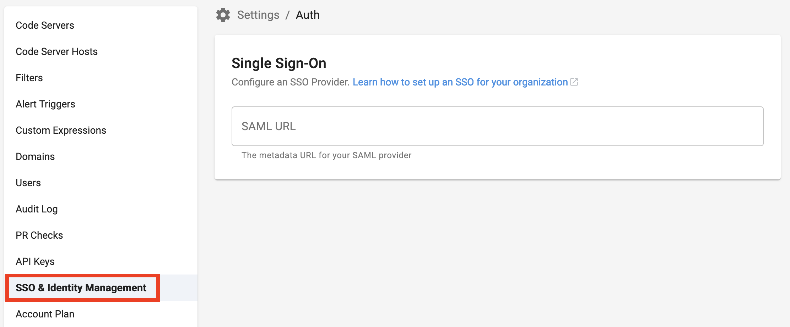

BluBracket supports single sign-on and federated identity services with Azure Active Directory using SAML. This article covers configuring the BluBracket app in Azure AD, configuring the Azure AD SAML federation in BluBracket, and managing users.

Once single sign-on is configured as described below, authentication, passwords, and two-factor authentication are managed and configured in Azure AD.

However, users must be registered in both BluBracket and Azure AD. Removing a user from either Azure or BluBracket will terminate their access to BluBracket. Additionally, the email address for each user in BluBracket must match the email address in Azure AD.

BluBracket requires an email attribute in order to successful identify and authenticate users; BluBracket looks for this value from the SAML identity claim `http://schemas.xmlsoap.org/ws/2005/05/identity/claims/emailaddress`.

### Register the BluBracket app in Azure Active Directory

1. Login to Azure AD as an Administrator [https://portal.azure.com](https://portal.azure.com)
2. Select the [Azure Active Directory service](https://portal.azure.com/#blade/Microsoft_AAD_IAM/ActiveDirectoryMenuBlade/Overview)
  
3. Select [Enterprise applications](https://portal.azure.com/#blade/Microsoft_AAD_IAM/StartboardApplicationsMenuBlade/AllApps/menuId/)
  
4. Select [+ New application](https://portal.azure.com/#blade/Microsoft_AAD_IAM/AppGalleryApplicationsBlade/category/)
  
5. Select Application you're developing

6. Select the link Ok, take me to App Registrations to register my new application
  
7. Select + New registration.
  
8. Register the Application
   1. App name: BluBracket
   2. Select the appropriate radio button for who can use this application
   3. Specify the Redirect URI
      1. Type: Web
      2. URI: `https://TENANT_NAME.blubracket.com/api/saml/sso` (Be sure to replace `TENANT_NAME` with the name of your tenant name provided by BluBracket)
   4. Select Register
     

### Get the federation metadata document URL from Azure AD

1. Navigate to [Azure Active Directory portal](https://portal.azure.com/#blade/Microsoft_AAD_IAM/ActiveDirectoryMenuBlade/Overview).
1. Under Manage, select App registrations, and then select Endpoints in the top menu, then copy and save the Federation metadata document.
  
1. Select the BluBracket application
  
1. Copy and save the Application (client) ID
  

### Set the SAML federation metadata document URL and client ID in BluBracket

1. Navigate to `https://TENANT_NAME.blubracket.com/settings/auth` (Be sure to replace `TENANT_NAME` with the name of your tenant name provided by BluBracket).
1. Enter the federation metadata document URL.
  
1. Enter the Application (client) ID from step 15
  

### Grant permissions to users in Azure AD to use BluBracket

1. Navigate to [Enterprise applications](https://portal.azure.com/#blade/Microsoft_AAD_IAM/StartboardApplicationsMenuBlade/AllApps/menuId/) in the Azure portal.
  
1. Select the BluBracket application
  
1. Add users:
  
    1. Select Users and groups, and then select Add user.
    2. On Add Assignment, select Users and groups to open the Users and groups selection list.
    3. Select as many groups or users as you want, then click or tap Select to add them to the Add Assignment list. You can also assign a role to a user at this stage.
    4. Select Assign to assign the users or groups to the selected enterprise application

### Add users in BluBracket

Tenant administrators must add users to their BluBracket tenant prior to login via single sign-on. [Full details are here](/how-to/add-user/).

### Test the Azure AD/SAML configuration

Open `https://TENANT_NAME.blubracket.com` in a new private browser window or open a different browser to test the Single Sign-on changes (Be sure to replace `TENANT_NAME` with the name of your tenant name provided by BluBracket). The login page should automatically redirect to Azure AD, if Azure AD authentication is successful, the user will then be redirected back to BluBracket and logged into the tenant.

Troubleshooting: use `https://TENANT_NAME.blubracket.com/login?force=true` to login via local authentication
