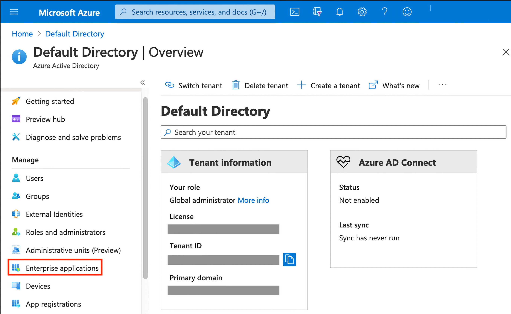
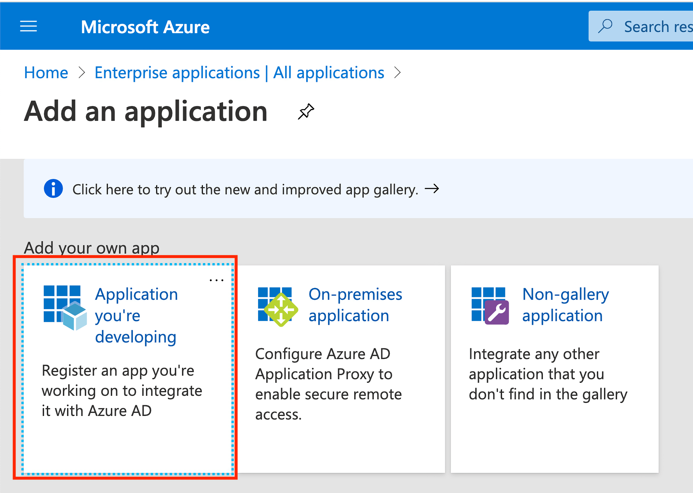
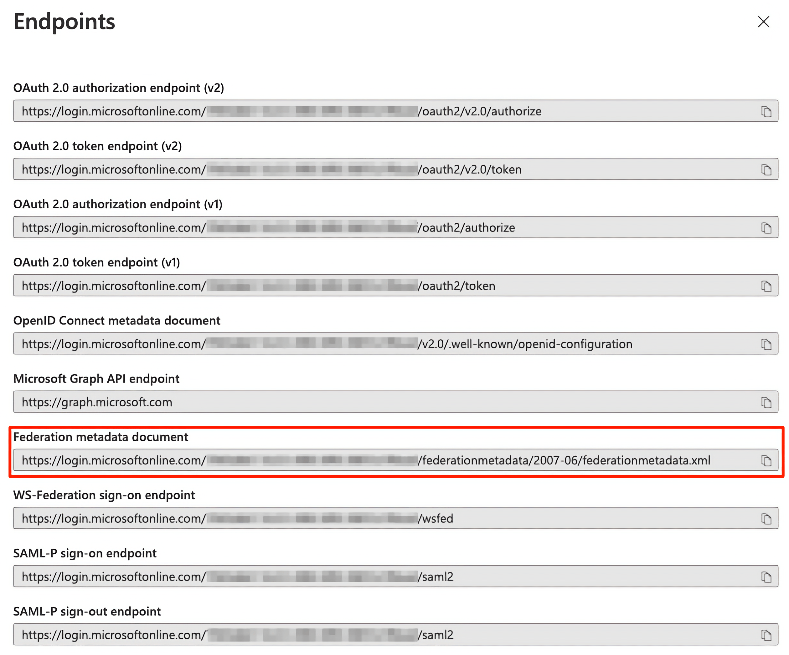
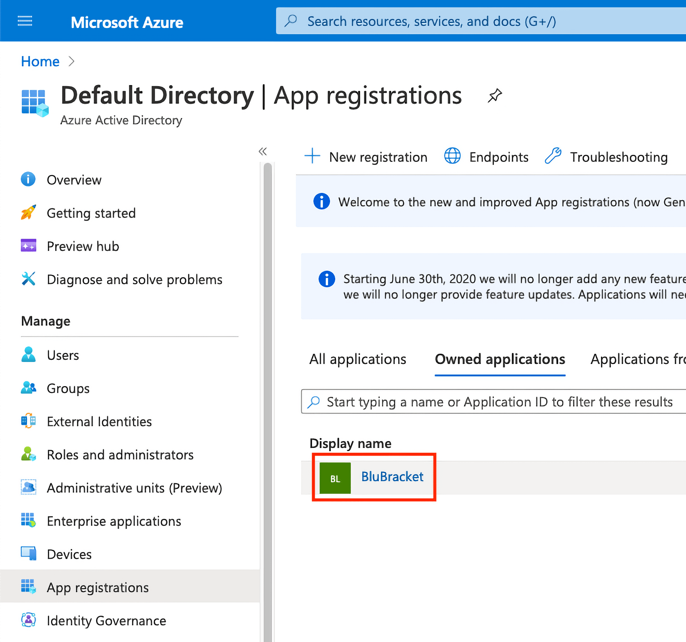
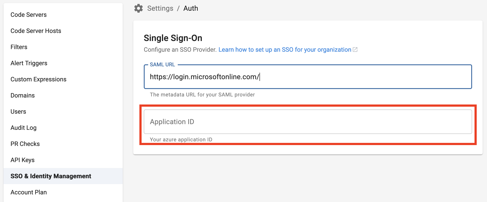

This article covers the SAML 2.0 authentication requests and responses that BluBracket supports for Single Sign-On (SSO) using Azure Active Directory (Azure AD).

BluBracket requires an email attribute in order to successful identify and authenticate users; BluBracket looks for this vaule from the SAML identity claim http://schemas.xmlsoap.org/ws/2005/05/identity/claims/emailaddress.

As of the last update to this article users must exists in BluBracket before they are able to login successfully using Single Sign-On.  BluBracket does not automatically register new users that do not previously exist in the tenant.

1. Login to Azure AD as an Administrator [https://portal.azure.com](https://portal.azure.com)
2. Select the Azure service Azure Active Directory [https://portal.azure.com/#blade/Microsoft_AAD_IAM/ActiveDirectoryMenuBlade/Overview](https://portal.azure.com/#blade/Microsoft_AAD_IAM/ActiveDirectoryMenuBlade/Overview)

3. Select Enterprise applications [https://portal.azure.com/#blade/Microsoft_AAD_IAM/StartboardApplicationsMenuBlade/AllApps/menuId/](https://portal.azure.com/#blade/Microsoft_AAD_IAM/StartboardApplicationsMenuBlade/AllApps/menuId/)

4. Select + New application [https://portal.azure.com/#blade/Microsoft_AAD_IAM/AppGalleryApplicationsBlade/category/](https://portal.azure.com/#blade/Microsoft_AAD_IAM/AppGalleryApplicationsBlade/category/)

5. Select Application you're developing

6. Select the link Ok, take me to App Registrations to register my new application

7. Select + New registration.

8. Register the Application
   1. App name: BluBracket
   2. Select the appropriate radio button for who can use this application
   3. Specify the Redirect URI
      1. Type: Web
      2. URI: https://TENANT_NAME.blubracket.com/api/saml/sso (Be sure to replace TENANT_NAME with the name of your tenant name provided by BluBracket)
   4. Select Register
   
9. Navigate back to Enterprise applications [(https://portal.azure.com/#blade/Microsoft_AAD_IAM/StartboardApplicationsMenuBlade/AllApps/menuId/)](https://portal.azure.com/#blade/Microsoft_AAD_IAM/StartboardApplicationsMenuBlade/AllApps/menuId/)

10. Select the BluBracket application

11. Add users
    1. Select Users and groups, and then select Add user.
    2. On Add Assignment, select Users and groups to open the Users and groups selection list.
    3. Select as many groups or users as you want, then click or tap Select to add them to the Add Assignment list. You can also assign a role to a user at this stage.
    4. Select Assign to assign the users or groups to the selected enterprise application

12. Navigate back to Azure Active Directory [https://portal.azure.com/#blade/Microsoft_AAD_IAM/ActiveDirectoryMenuBlade/Overview](https://portal.azure.com/#blade/Microsoft_AAD_IAM/ActiveDirectoryMenuBlade/Overview)
    1. Under Manage, select App registrations, and then select Endpoints in the top menu.
13. Copy and save the Federation metadata document

14. Select the BluBracket application

15. Copy and save the Application (client) ID

16. Navigate to https://TENANT_NAME.blubracket.com/settings/auth (Be sure to replace TENANT_NAME with the name of your tenant name provided by BluBracket)
    1. Expand Single Sign-On and enter the Federation metadata document URL from step 13.

17. Enter the Application (client) ID from step 15

18. Tenant administrators will be required to add the desired Azure AD users to their BluBracket tenant prior to login via Single Sign-On. (https://TENANT_NAME.blubracket.com/settings/users) (Be sure to replace TENANT_NAME with the name of your tenant name provided by BluBracket)

19. Open https://TENANT_NAME.blubracket.com in a new private browser window or open a different browser to test the Single Sign-on changes (Be sure to replace TENANT_NAME with the name of your tenant name provided by BluBracket)
    1. The login page should automatically redirect to Azure AD, if Azure AD authentication is successful, the user will then be redirected back to BluBracket and logged into the tenant.

Troubleshooting: use https://TENANT_NAME.blubracket.com/login?force=true to login via local authentication
