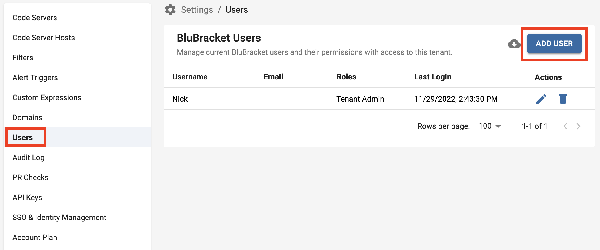

The first thing you might want to do is add your team members to assist with the setup and management. As soon as you log into your BluBracket tenant, you should create at least  one additional user for the admin portal:

1. Go to Settings.

2. Click the Users Tab.

1. Click Add User

1. Assign a unique username.

2. Enter the user’s email address.

3. Click Create.
