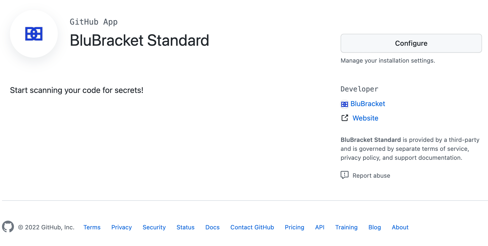

#### Prerequisites

To install GitHub Checks, permissions to install a GitHub App on an org are required.  This would be an [organization owner or someone with admin level permissions in a repository](https://docs.github.com/en/developers/apps/differences-between-github-apps-and-oauth-apps#who-can-install-github-apps-and-authorize-oauth-apps)

#### GitHub cloud checks setup for BluBracket free trial edition {#freetrial}

This version of GitHub Checks is for customers using a BluBracket Free Trial tenant.

1. Navigate to BluBracket portal, import code server, track repos

2. Install the following app on the organization (should be done by someone who has permissions to install the app): [https://github.com/apps/blubracket-standard](https://github.com/apps/blubracket-standard)

3. Future PRs + commits to PRs should automatically run the scans via GitHub Checks

#### GitHub cloud checks setup for BluBracket enterprise tenants {#enterprise}

This version of GitHub Checks is for paid customers running on the BluBracket production servers

1. Navigate to BluBracket portal, import code server, track repos

2. Install the following app on the organization (should be done by someone who has permissions to install the app): [https://github.com/apps/blubracket-checks-app](https://github.com/apps/blubracket-checks-app)

3. Future PRs + commits to PRs should automatically run the scans via GitHub Checks

#### GitHub enterprise server checks setup {#onpremise}

This version of GitHub Checks is for paid customers using the on-premise GitHub Enterprise Server

1. Navigate to the BluBracket portal, import code server, track repos

2. Create the GitHub Enterprise Server Checks app (follow the instructions at https://github.com/BluBracket/blubracket-tools/tree/main/github-checks-app )

    * As part of the last step in that README.md file, send over the relevant configuration details. Wait for confirmation from us that our internal set up has been completed before proceeding.

3. Install the app created from step 2 on the organization (should be done by someone who has permissions to install the app).

Future PRs + commits to PRs should automatically run the scans via GitHub Checks

#### GitHub checks workflow {#workflow}

The BluBracket GitHub checks workflow will run on your CI/CD workflow within GitHub.  For example when a pull request is made the BluBracket GitHub checks will scan the pull request for secrets.  

For example when a secret is found within a pull request, the check will fail and will give details on where and what type of secret was found.



If the BluBracket checks app doesn't find any blocking items such as secrets, the check will pass and the pull request can be successfully merged.


