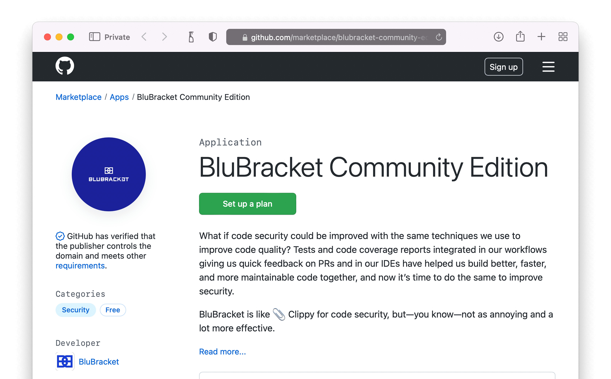

## Prerequisites

To install the BluBracket app for GitHub Checks, permissions to install a GitHub App on an org are required. This would be an [organization owner or someone with admin level permissions in a repository](https://docs.github.com/en/developers/apps/differences-between-github-apps-and-oauth-apps#who-can-install-github-apps-and-authorize-oauth-apps).

## Choosing which app to install

The BluBracket app for GitHub Checks is available for all BluBracket editions, and multiple offerings of GitHub.

|                               | GitHub Cloud                                                                         | GitHub Enterprise (including Server) |
|-------------------------------|--------------------------------------------------------------------------------------|--------------------------------------|
| BluBracket Community Edition  | [BluBracket Community & Team Edition](#community-and-team) | n/a                                  |
| BluBracket Team Edition       | [BluBracket Community & Team Edition](#community-and-team) | n/a                                  |
| BluBracket Enterprise Edition | [BluBracket Enterprise Edition](#enterprise)               | [BluBracket Enterprise Edition & GitHub Enterprise Server](#onpremise)                             |

## GitHub Checks setup for GitHub Cloud and BluBracket Community & Team Edition accounts {#community-and-team}

BluBracket Community and Team Edition accounts are monitored by the [BluBracket Community Edition app.](https://github.com/apps/blubracket-community-edition).

The BluBracket app for GitHub Checks is automatically installed when adding a GitHub org to your BluBracket Community Edition and BluBracket Team Edition account.

Note: if you added your GitHub org to BluBracket before 1 June 2022, the GitHub Checks was not automatically configured. Please follow these instructions to add GitHub Checks:

- If you are monitoring all repos in the GitHub org: [go through the steps to add the GitHub org as a code server again](/how-to/code-servers/add-code-servers/github-cloud-oauth/) (don't delete the old code server). This won't create any duplicate, it will simply add GitHub Checks to the existing configuration.
- If you are *not* monitoring all repos in the GitHub org: remove the current code server and [re-add it to BluBracket](/how-to/code-servers/add-code-servers/github-cloud-oauth/). When re-adding the code server, the GitHub interface will allow you to select which repos you wish to monitor.

Whatever path you choose, your future PRs + commits to PRs in monitored repos will be checked by BluBracket.

## GitHub Checks setup for BluBracket Enterprise accounts {#enterprise}

BluBracket Enterprise Edition accounts are monitored by the [BluBracket Checks App.](https://github.com/apps/blubracket-checks-app).

Once your BluBracket Enterprise Edition account is configured and code servers setup, simply install the [BluBracket Checks App.](https://github.com/apps/blubracket-checks-app) (this must be done by someone who has permissions in GitHub to install the app). Once installed, your future PRs + commits to PRs in monitored repos will be checked by BluBracket.

## GitHub Checks setup for GitHub Enterprise Server {#onpremise}

This version of GitHub Checks is for paid customers using the on-premise GitHub Enterprise Server

1. Setup your BluBracket Enterprise Edition and configure code servers setup
2. Create the GitHub Enterprise Server Checks app (follow [the instructions here](https://github.com/BluBracket/blubracket-tools/tree/main/github-checks-app))
    1. One step in those instructions is to send the configuration details to the customer success team. Wait for confirmation from the team before proceeding.
3. Install the app created from step 2 on the organization (this must be done by someone who has permissions in GitHub to install the app).

Once installed, your future PRs + commits to PRs in monitored repos will be checked by BluBracket.

## BluBracket app for GitHub Checks workflow {#workflow}

Whatever version of the BluBracket app for GitHub Checks you choose, it will run for every pull request, and for every new commit to any open pull requests.

The app will alert you to any secrets found in the pull request, including both the tip of the pull request and the history of any commits. The alert includes details on where and what type of secret was found.



By default, the BluBracket app for GitHub Checks does not block any pull requests. Usage statistics show over 80% of warnings about secrets in PRs are fixed before commit, and the non-blocking workflow is more respectful of developer needs.
