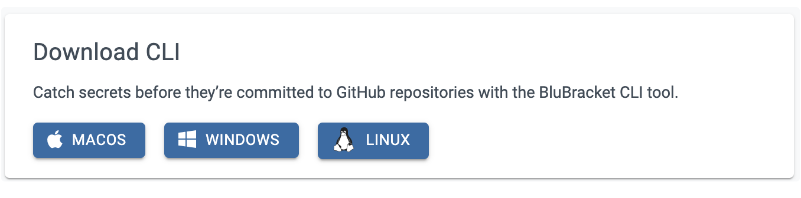

[Windows Installation](#windows-installation) | [macOS Installation](#macos-installation) | [Linux Installation](#linux-installation) | [Try out the BluBracket CLI commit hook](#try-out-the-blubracket-cli-commit-hook)

Installing the BluBracket CLI Tool is simple! Download the tool from the BluBracket portal:

1. Login to your BluBracket portal

2. Select Settings from left pane menu

3. Select Code Scanning

4. Download the CLI OS version of your choice (Mac, Windows, Linux)

#### Windows Installation

1. Extract the files into any directory that is available in PATH.

2. For example, into the git installation folder, "C:\Program Files\Git\cmd"

3. Verify the installation

        C:\Users\vbuzu>blubracket --version blubracket 2021-01-14-42f4dfe2c2abef161ee5066b0b774b41832c7c51

##### Setting up git hooks for Windows

* In your terminal, cd to your repository directory, then run blubracket install-git-hooks

     C:\Users\vbuzu\projects\sandbox>blubracket install-git-hooks Successfully installed pre-commit hook to 'C:/Users/vbuzu/projects/sandbox/.git/hooks/pre-commit'

* If git is setup to use global git hooks (specified by core.hooksPath git config), CLI will update/install the hook in that global folder.

* Currently BluBracket CLI will set only one hook, pre-commit.

#### macOS Installation

1. The macOS .pkg will automatically install the app into the /Applications/BluBracket folder (or the ~/Applications/BluBracket folder if you selected install for me only).

2. Open a terminal and add the BluBracket path to your bash profile:
     * If you selected **Install for all users of this computer:**

     `echo 'export PATH="/Applications/blubracket:$PATH"' >>~/.bash_profile source ~/.bash_profile`

     * Alternatively, if you selected Install for me only:

     `echo 'export PATH="~/Applications/blubracket:$PATH"' >>~/.bash_profile; source ~/.bash_profile`

3. If your IDE is open you may need to restart it in order to pick up the new bash profile changes.

4. Verify the installation

    `% blubracket --version blubracket 2021-01-14-42f4dfe2c2abef161ee5066b0b774b41832c7c51`

     * Note: If blubracket is not found when attempting to run blubracket --version, you may also need to perform the following

     * Create a file named blubracket in /etc/paths.d. The file content should be /Applications/BluBracket

     * Example:

          * Open the terminal and cd to your desktop
          * Type: echo “Applications/BluBracket” > blubracket
          * Open Finder and move the blubracket file from your desktop into /etc/paths.d
               * etc is a hidden folder, so you may need to select Command+Shit+. to show hidden folders and files
          * Restart your terminal or application for changes to take effect.

##### Setting up git hooks on macOS

* In your terminal, `cd` to your repository directory, then run `blubracket install-git-hooks`

* `% blubracket install-git-hooks Successfully installed pre-commit hook to '/Users/vbuzu/sandbox/.git/hooks/pre-commit'`

* NOTE:
  * If git is setup to use global git hooks (specified by `core.hooksPath` git config), BluBracketCLI will update/install the hook in that global folder.

  * Currently BluBracket CLI will set only one hook, `pre-commit`.

#### Linux Installation

* Extract the file into any directory that is available in PATH.

* Please follow instructions from step 2 onwards in macOS section above.

#### Try out the BluBracket CLI commit hook

* In your terminal, `cd` to your repository directory

* Then add the following example secret into any file in your repository:
     `myPassword="My$uperDuperS3cret!"`

* Now try to commit your change with git commit - your new BluBracket CLI hook should prevent the commit from happening.
