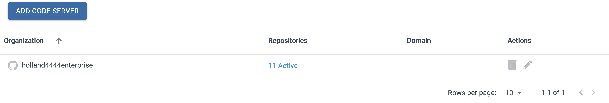
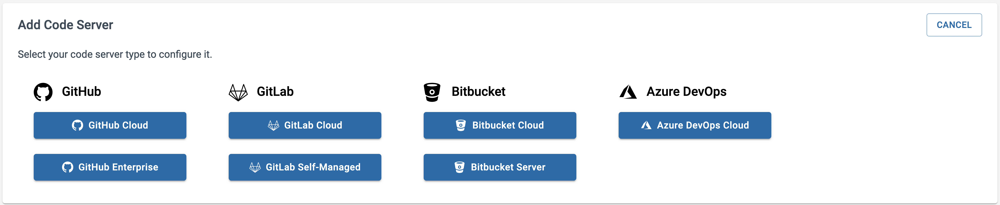

The first step in setting up a BluBracket tenant is adding code servers.  This enables the BluBracket servers to communicate with a company’s Git services, which are necessary to generate alerts, insights, and reports.  

### Navigating to the "enterprise code servers" section of the "settings" page

Adding a code server starts with navigating to the appropriate section in the Settings section of the tenant portal. After authenticating into the portal, select the Settings option in the left navigation bar.

Once the setting section is exposed, select the “enterprise code servers” section.  This will reveal any code servers that have already been configured as well as the “add code server” button for adding new code servers.

### Selecting a server type

Now that the configuration bar is exposed, the first thing we want to do is select a Server Type.  We will be setting up a GitHub Cloud server, so select the “GitHub Cloud” option.

