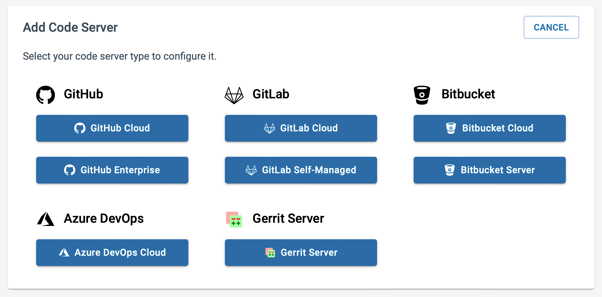

The first step in setting up a BluBracket tenant is adding code servers. This enables the BluBracket servers to communicate with a company’s git services, which are necessary to generate alerts, insights, and reports.

### Navigating to the "enterprise code servers" section of the "settings" page

Adding a code server starts with navigating to the appropriate section in the Settings section of the tenant portal. After authenticating into the portal, select the Settings option in the left navigation bar.

Once the setting section is exposed, select the “enterprise code servers” section. This will reveal any code servers that have already been configured as well as the “add code server” button for adding new code servers.

### Selecting a server type

Different BluBracket editions support different server types:

|   | BluBracket Community Edition | BluBracket Team Edition | BluBracket Enterprise Edition |
|---|---|---|---|
| GitHub Cloud | [Add via OAuth](/how-to/code-servers/add-code-servers/github-cloud-oauth/) | [Add via OAuth](/how-to/code-servers/add-code-servers/github-cloud-oauth/) | [Add via PAT](/how-to/code-servers/add-code-servers/github-cloud/) |
| GitHub Enterprise Server | Not supported | Not supported | Add via PAT |
| GitLab Cloud | [Add via PAT](/how-to/code-servers/add-code-servers/gitlab-cloud/) | [Add via PAT](/how-to/code-servers/add-code-servers/gitlab-cloud/) | [Add via PAT](/how-to/code-servers/add-code-servers/gitlab-cloud/) |
| GitLab on-prem | Not supported | Not supported | Add via PAT|
| Bitbucket Cloud | [Add via PAT](/how-to/code-servers/add-code-servers/bitbucket-cloud/) | [Add via PAT](/how-to/code-servers/add-code-servers/bitbucket-cloud/) | [Add via PAT](/how-to/code-servers/add-code-servers/bitbucket-cloud/) |
| BitBucket server | Not supported | Not supported | Add via PAT |
| Azure DevOps | [Add via PAT](/how-to/code-servers/add-code-servers/azure-devops/) | [Add via PAT](/how-to/code-servers/add-code-servers/azure-devops/) | [Add via PAT](/how-to/code-servers/add-code-servers/azure-devops/) |
| Gerrit | [Add via PAT](/how-to/code-servers/add-code-servers/gerrit/) | [Add via PAT](/how-to/code-servers/add-code-servers/gerrit/) | [Add via PAT](/how-to/code-servers/add-code-servers/gerrit/) |

