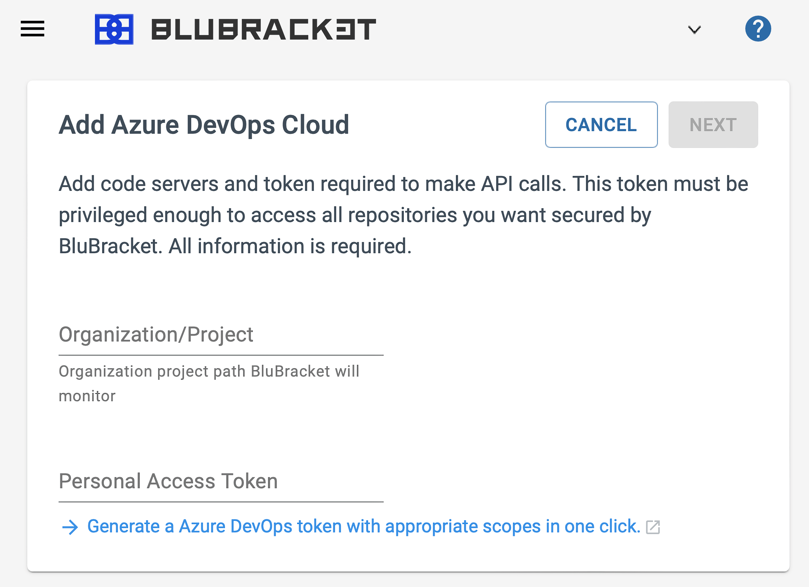

After [selecting to add an Azure DevOps code server](), follow the instructions below to add an Azure DevOps Organization as a code server in BluBracket.

Each Azure DevOps Organization is a different code server in BluBracket.

### Entering the organization name

Enter the short form of the Azure DevOps Organization name. The short form of the name is the version shown in the URL for the org.

### Generating and entering a personal access token (PAT)

BluBracket uses a personal access token to access the repos you wish to scan ([see Azure's docs on personal access tokens](https://docs.microsoft.com/en-us/azure/devops/organizations/accounts/use-personal-access-tokens-to-authenticate?view=azure-devops&tabs=Windows)).

[Instructions on generating and entering a personal access token.](/how-to/code-servers/add-code-servers/azure-devops/generate-pat/)
