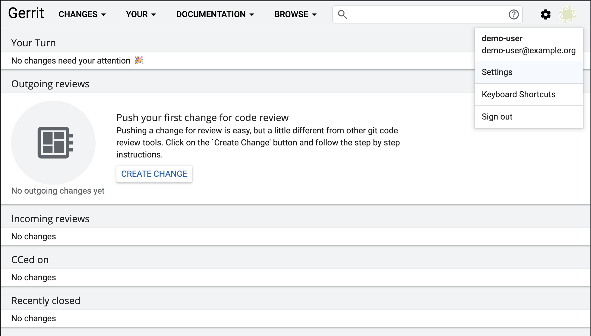
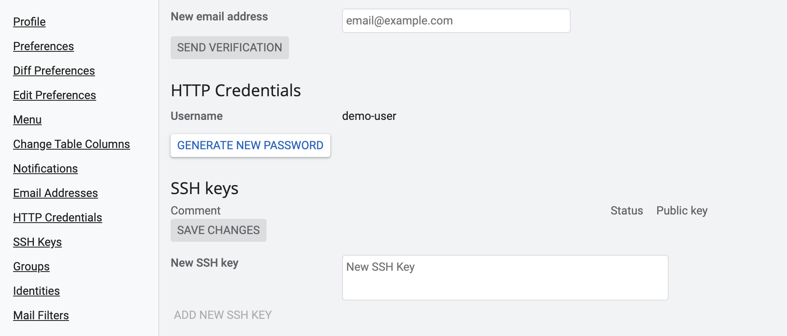
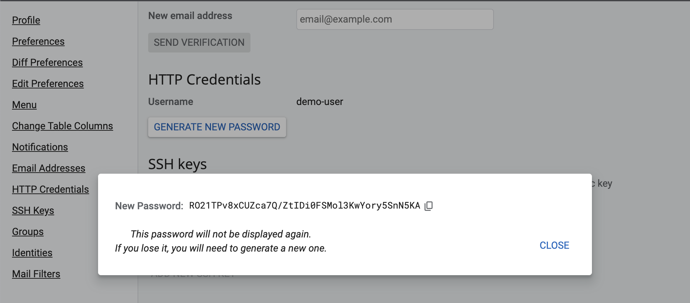
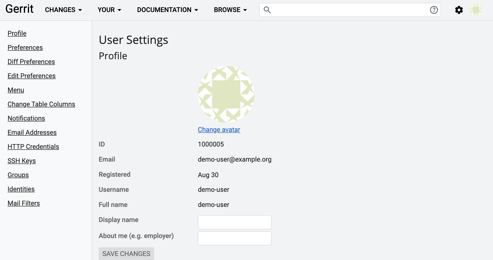
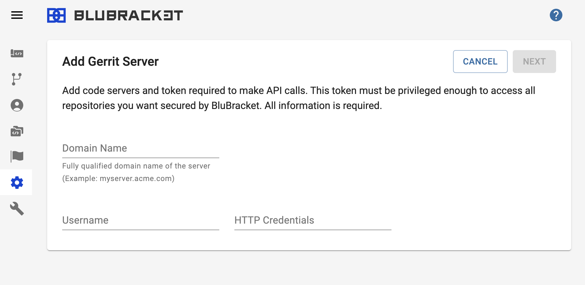

In order for BluBracket to access information on the Gerrit code review host, HTTP credentials must be generated.

#### Generating HTTP credentials

* Once signed in to Gerrit, click the icon in the upper-right hand corner to see the settings dropdown.

* Scroll down to the HTTP credentials section of the user settings page.

* Click "Generate New Password" for the new HTTP credentials.

#### Entering username and HTTP credentials

A username and HTTP credentials are necessary for BluBracket to access the Gerrit code review host.

* See the username in the profile section of the user settings page.

* After generating the HTTP credentials and taking note of the username, enter them into BluBracket.

