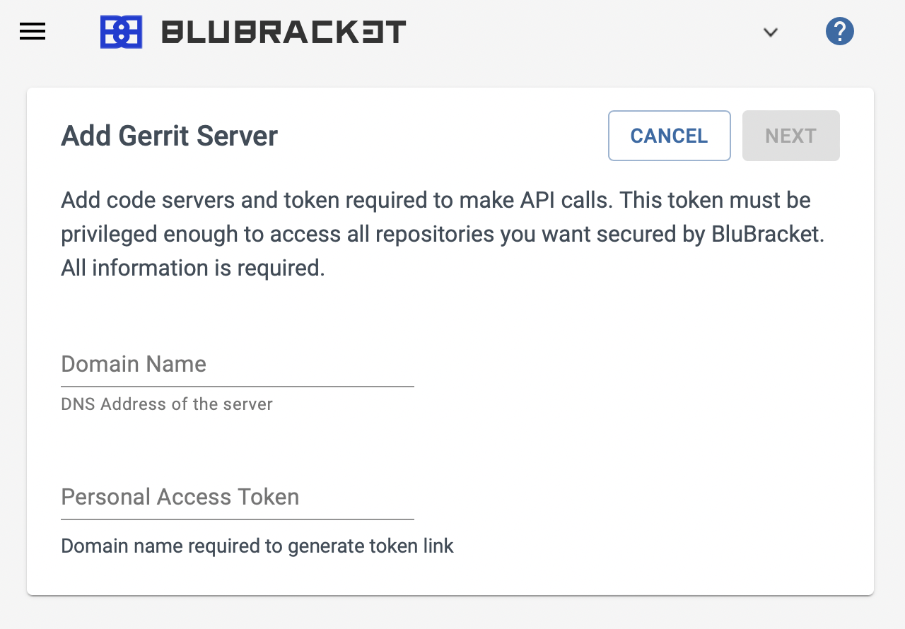

After [selecting to add a Gerrit code server](), follow the instructions below to add a Gerrit server in BluBracket. Each Gerrit code review host is a different code server in BluBracket.

### Enter the host/domain name

Enter the hostname of the Gerrit code review server

### Enter the access token

A token is necessary for BluBracket to access the Gerrit code review host.
