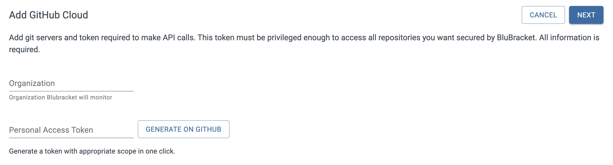
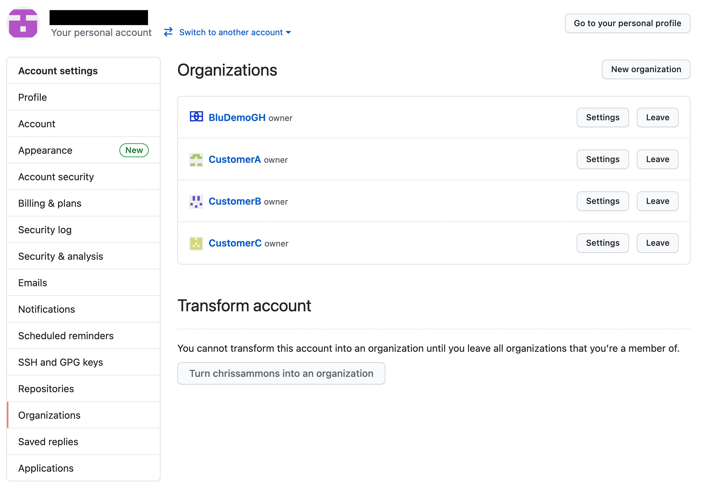

After [selecting to add a GitHub Cloud code server](), follow the instructions below to add a GitHub Organization as a code server in BluBracket.

GitHub uses the term "GitHub Cloud" to differentiate repositories hosted at github.com from their self-hosted enterprise offering.

Each GitHub Organization is a different code server in BluBracket ([see GitHub's docs on Organizations](https://docs.github.com/en/organizations/collaborating-with-groups-in-organizations/about-organizations)).

### Entering the organization name

Enter the short form of the GitHub Organization name. The short form of the name is the version shown in the URL for the org.

For example: [The Linux Foundation Engineering](https://github.com/LF-Engineering) org's short form name is `LF-Engineering` as seen in the URL on that page.

You can see all organizations you are a member of in your GitHub account at [https://github.com/settings/organizations.](https://github.com/settings/organizations):

### Generating and entering a personal access token (PAT)

BluBracket uses a personal access token to access the repos you wish to scan ([see GitHub's docs on personal access tokens](https://docs.github.com/en/authentication/keeping-your-account-and-data-secure/creating-a-personal-access-token)).

[Instructions on generating and entering a personal access token.](/how-to/code-servers/add-code-servers/github-cloud/generate-pat/)
