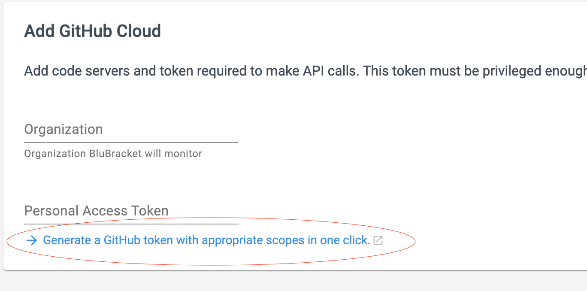
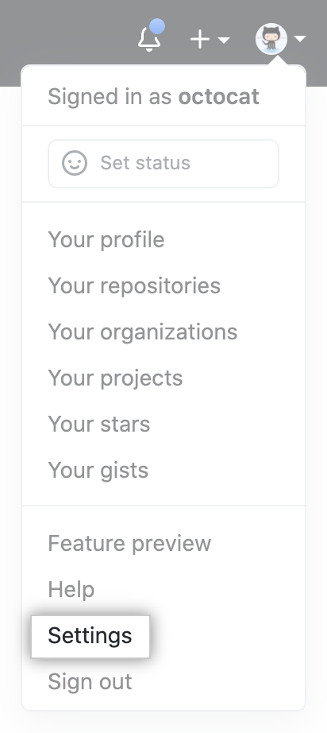
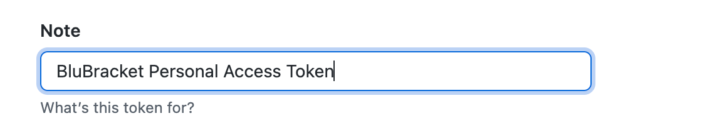
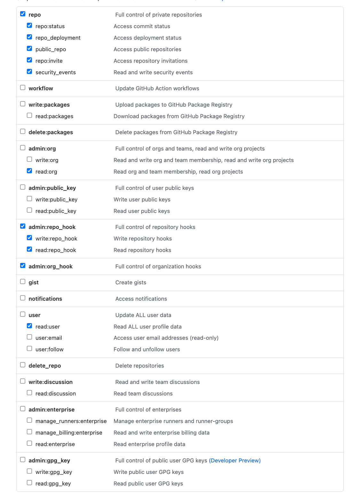

#### Creating a GitHub personal access token

* In order for BluBracket to access information within a given repository, an access token must be uploaded into the tenant.  

* If you want to use a PAT to access resources owned by an organization that uses SAML SSO, you must authorize the PAT. For more information, see ["About authentication with SAML single sign-on"](https://docs.github.com/en/enterprise-cloud@latest/authentication/authenticating-with-saml-single-sign-on/about-authentication-with-saml-single-sign-on) and ["Authorizing a personal access token for use with SAML single sign-on"](https://docs.github.com/en/enterprise-cloud@latest/authentication/authenticating-with-saml-single-sign-on/authorizing-a-personal-access-token-for-use-with-saml-single-sign-on) in the GitHub Enterprise Cloud documentation.

* In the BluBracket settings page when selecting GitHub Cloud you will be presented with the option to generate a GitHub token with appropriate scopes.  You must be signed into the GitHub account that you wish to use with BluBracket for this function to work. This option is only available for GitHub Cloud.

#### Generating a token

* [Verify your email address](https://docs.github.com/en/github/getting-started-with-github/verifying-your-email-address), if it hasn't been verified yet.

* In the upper-right corner of any page, click your profile photo, then click **Settings**.

* In the left sidebar, click  Developer settings.

* In the left sidebar, click Personal access tokens.

* Click Generate new token.

* Give your token a descriptive name.

* To give your token an expiration, select the Expiration drop-down menu, then click a default or use the calendar picker.

* Select the scopes, or permissions, you'd like to grant this token. The screenshot below shows the scopes or permissions that BluBracket needs.

* Click Generate token.

* The token will be displayed on the screen and you will have the option to copy it into your clipboard.  The token will not be accessible in the future so ensure you have copied it before closing the window.

* To use your token to authenticate to an organization that uses SAML single sign-on, authorize the token. For more information, see ["Authorizing a personal access token for use with SAML single sign-on"](https://docs.github.com/en/enterprise-cloud@latest/authentication/authenticating-with-saml-single-sign-on/authorizing-a-personal-access-token-for-use-with-saml-single-sign-on) in the GitHub Enterprise Cloud documentation.

#### Entering your personal access token

* After generating your personal access token, it needs to be entered into BluBracket. In the BluBracket portal go **Settings**, and then click **Add Code Server**.

* On the **Add Code Server** page select GitHub Cloud

* After selecting **GitHub Cloud** you will be presented with the page to enter your organization and personal access token.  Enter the organization with the repositories you wish to monitor and paste your personal access token.

* Click next and then select **All repositories** or choose which repositories you wish to monitor.
