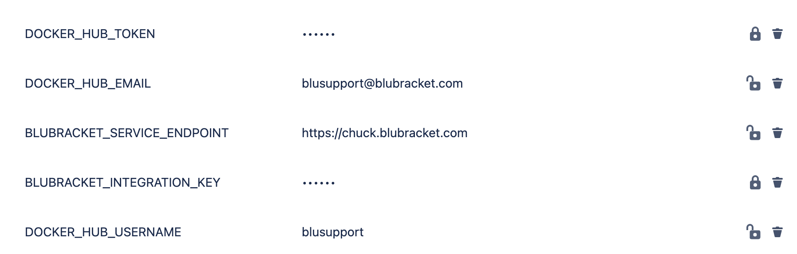
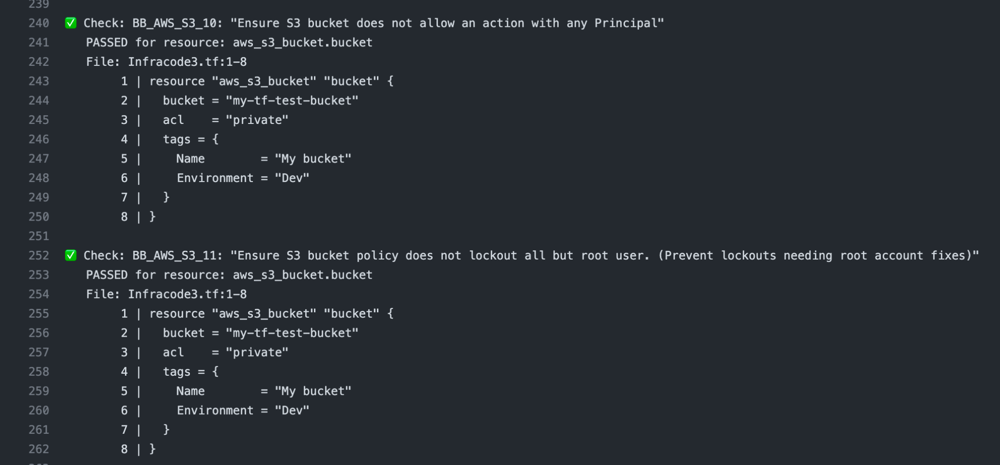
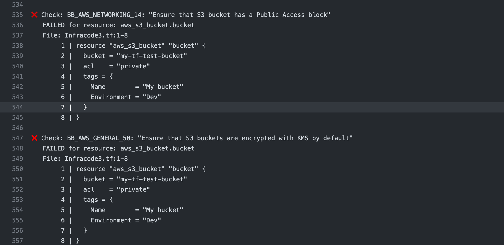
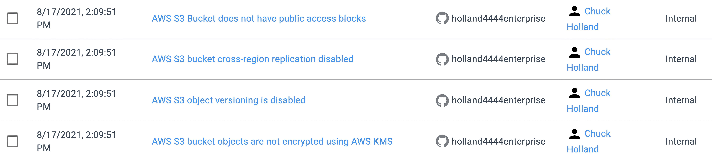

#### Step 1: Create Bitbucket Repository Variables:**

* Log into Bitbucket and select a repository where you want to enable Infrastructure as Code scanning.

* Within the repository, select Repository settings, then Repository variables

* Create five new Repositories variables

Name: **DOCKER_HUB_EMAIL**

value: blusupport@blubracket.com

Name: **DOCKER_HUB_USERNAME**

value: blusupport

Name: **DOCKER_HUB_TOKEN**

value: 085ef825-b366-4636-be2a-8babaf65064f

Name: **BLUBRACKET_SERVICE_ENDPOINT**

value: BluBracket Tenant name

Example: https://acme.blubracket.com

Name: **BLUBRACKET_INTEGRATION_KEY**

value: BluBracket Integration API key

Steps to create a BluBracket API token:
[https://support.blubracket.com/hc/en-us/articles/4403018405140-Event-and-Alert-APIs](https://support.blubracket.com/hc/en-us/articles/4403018405140-Event-and-Alert-APIs)



#### Step 2: Create Pipeline Workflow:

* Within the repository, select Pipelines and either update an existing pipelines.yaml script or create a new one

* Add the following script to enable Infrastructure as Code scanning:

```yaml
pipelines:
  pull-requests:
    '**':
      - step:
          name: 'Run BluBracket IaC Scan'
          image:
            name: blubracket/iac-checker:0.0.4-beta
            username: $DOCKER_HUB_USERNAME
            password: $DOCKER_HUB_TOKEN
            email: $DOCKER_HUB_EMAIL
          script:
            - echo "Running BluBracket IaC scan"
            - env
            - cd /home/blubracket/iac-checker
            - pipenv run run --repo-directory ${BITBUCKET_CLONE_DIR} --source-branch ${BITBUCKET_BRANCH} -target-branch ${BITBUCKET_PR_DESTINATION_BRANCH} --do-not-fail-on-misconfigurations
  branches:
    main:
      - step:
          name: 'Run Blubracket IaC Scan'
          image:
            name: blubracket/iac-checker:0.0.4-beta
            username: $DOCKER_HUB_USERNAME
            password: $DOCKER_HUB_TOKEN
            email: $DOCKER_HUB_EMAIL
          script:
            - echo "Running BluBracket IaC scan"
            - env
            - cd /home/blubracket/iac-checker
            - pipenv run run --repo-directory ${BITBUCKET_CLONE_DIR} --do-not-fail-on-misconfigurations --source-branch ${BITBUCKET_BRANCH}
```

#### Step 3: Run Workflow

* Ensure workflow runs successfully.   This can be verified by expanding the **pipenv run**  karat:


* If Infrastructure as Code was detected, you will see entries that indicate a check has been performed (green check indicating scan passed, a red “x” indicating a risk has been detected).





* For all detected risks (red “x”), an alert will be posted to the BluBracket portal.


