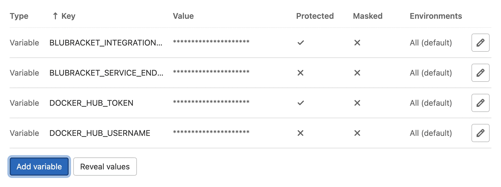
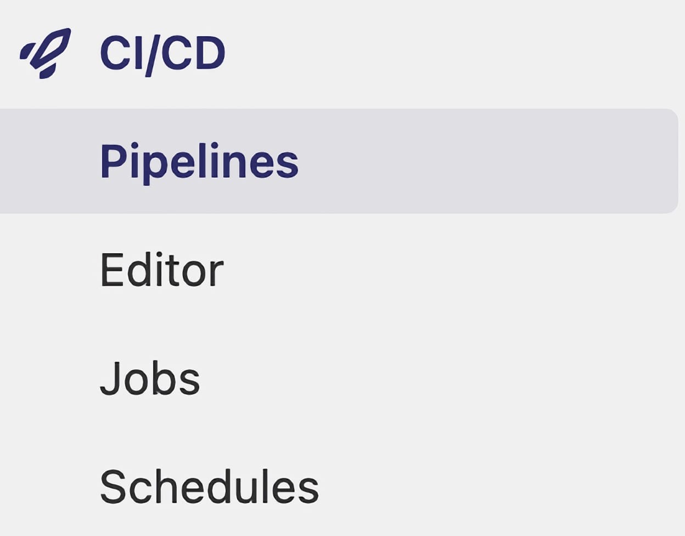
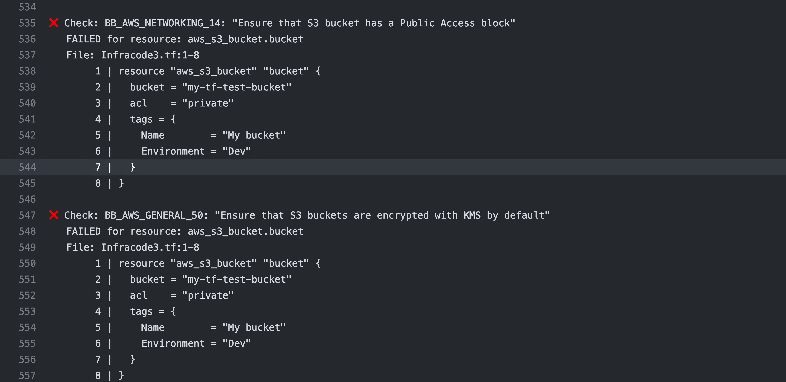
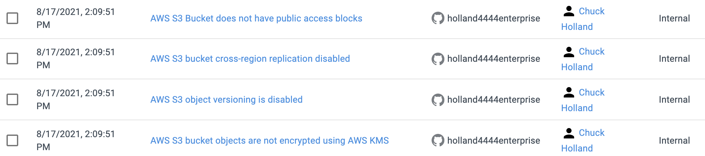

#### Step 1: Create GitLab Repository Variables:

* Log into GitLab and select a repository where you want to enable Infrastructure as Code scanning.

* Within the repository, select **Settings**, then **CI/CD**

* Expand Variables section and select Add variable

* Create four new variables:

Name: DOCKER_HUB_USERNAME

value: blusupport

Name: DOCKER_HUB_TOKEN

value: 085ef825-b366-4636-be2a-8babaf65064f

Name: BLUBRACKET_SERVICE_ENDPOINT

value: BluBracket Tenant name

Example: https://acme.blubracket.com

Name: BLUBRACKET_INTEGRATION_KEY

value: BluBracket Integration API key

Steps to create a BluBracket API token:

[https://support.blubracket.com/hc/en-us/articles/4403018405140-Event-and-Alert-API](https://support.blubracket.com/hc/en-us/articles/4403018405140-Event-and-Alert-APIs)



#### Step 2: Create Pipeline Workflow:

* Within the repository, select CI/CD, then Pipelines to either update an existing ci.yaml script or create a new one via the Editor option:



* Add the following script to enable Infrastructure as Code scanning:

```yaml
infra-as-code-scan:
  # Use the official docker image.
  image: docker:latest
  stage: build
  services:
    - docker:dind
  variables:
    GIT_STRATEGY: clone
    GIT_DEPTH: 0
  before_script:
    - docker login -u "$DOCKERHUB_USERNAME" -p "$DOCKERHUB_TOKEN"
  script:
    - env
    - |
      set -ax

      docker run -v ${CI_PROJECT_DIR}:/home/blubracket/iac-checker/repo \
        -u $(id -u):$(id -g) \
        blubracket/iac-checker:0.0.4-beta run \
        --blubracket-service-endpoint ${BLUBRACKET_SERVICE_ENDPOINT} \
        --integration-key ${BLUBRACKET_INTEGRATION_KEY} \
        --source-branch ${CI_MERGE_REQUEST_SOURCE_BRANCH_NAME:-${CI_COMMIT_BRANCH}} \
        --target-branch ${CI_MERGE_REQUEST_TARGET_BRANCH_NAME:-""} \
        --do-not-fail-on-misconfigurations
  rules:
    # Run diff workflow on all merge requests
    - if: '$CI_PIPELINE_SOURCE == "merge_request_event"'
    # Run branch workflow on pushes to default branch
    - if: '$CI_COMMIT_BRANCH == $CI_DEFAULT_BRANCH'

```

#### Step 3: Run Workflow

* Ensure workflow runs successfully.   This can be verified by selecting Jobs and expanding the **Executing “step_script”** karat and scrolling to bottom of page:


* If Infrastructure as Code was detected, you will see entries that indicate a check has been performed (green check indicating scan passed, a red “x” indicating a risk has been detected).




* For all detected risks (red “x”), an alert will be posted to the BluBracket portal.


