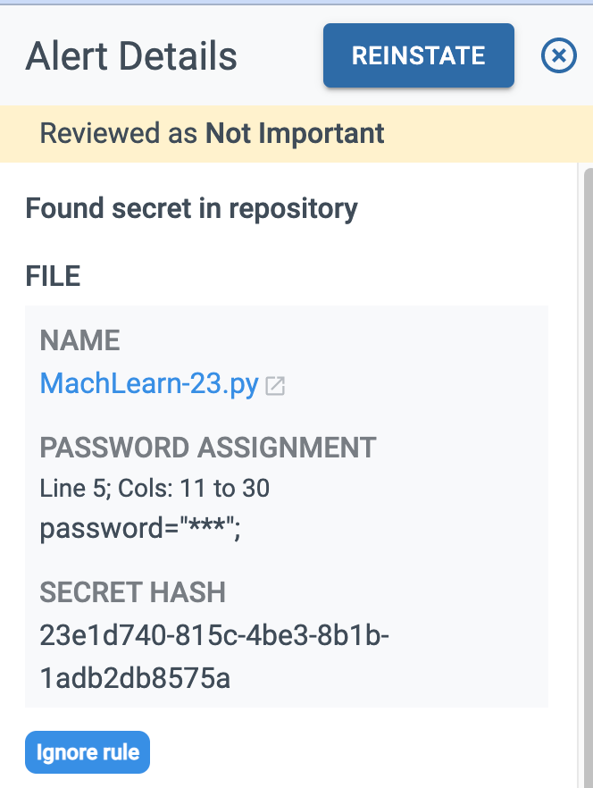

Ignore rules can be set up globally for a BluBracket tenant. blubracket-ignore.yaml allows Blubracket users to ignore specific secret types, secret values, or paths. This file must be sent utilizing the Blubracket API’s. When a match of the ignore file is made, an alert will not be created however an event will still be made.

Note: This will not change any existing alerts/events in the platform.

1. Download integration API key
1. Set environment variables

    The `TOKEN` for `BLUBRACKET_INTEGRATION_KEY` can be found in the `.json` file downloaded after generating an API key.

    The `BLUBRACKET_HOST` is the base URL for your BluBracket account, prepended with `https://` and with no trailing `/`.
    * On Linux and macOS:
        * `export BLUBRACKET_INTEGRATION_KEY='TOKEN'`
        * `export BLUBRACKET_HOST='https://YOURBLUBRACKETHOST.blubracket.com'`
    * Windows:
        * `$Env:BLUBRACKET_INTEGRATION_KEY='TOKEN'`
        * `$Env:BLUBRACKET_HOST ='https://YOURBLUBRACKETHOST.blubracket.com'`
1. Create blubracket-ignore.yaml

    ```yaml
    # ignores any of the paths below
    - paths:
      - oanda_connector.py
      - MachLearn-23.py

    # ignores any secret values below
    - secret_values:
      - My$uperDuperP@ssw0rd!

    # ignores any secret types below
    - secret_types:
      - aws_access_key_id

    # per repo-rules
    - repo_url: (?i)github.com/blubracket/(apache_tomcat_2.0|crm_order_management)
      rules:
        - secret_values:
          - My$uperDuperS3cret!
        - secret_types:
          - google_oauth
        - paths:
          - helm/values.yaml
    ```

1. Upload yaml file via API using curl:

    ```bash
    curl -H "Authorization: Bearer ${BLUBRACKET_INTEGRATION_KEY}" --data-binary "@blubracket-ignore.yaml" ${BLUBRACKET_HOST}/api/public/blubracket-ignore

    ```

1. Confirm upload using:

    ```bash
    curl -i -H "Authorization: Bearer ${BLUBRACKET_INTEGRATION_KEY}" ${BLUBRACKET_HOST}/api/public/blubracket-ignore
    ```

1. To delete blubracket-ignore:

    ```bash
    curl -i -X DELETE -H "Authorization: Bearer ${BLUBRACKET_INTEGRATION_KEY}" ${BLUBRACKET_HOST}/api/public/blubracket-ignore
    ```

Any new secrets, PII or Non-inclusive language ignored will automatically be annotated as “Reviewed as Not Important” and labeled as “Ignore rule”


