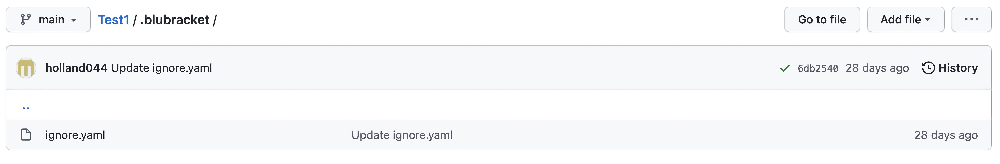

In some cases a repo administrator may want to ignore specific secret types, secret values, or paths. This can be achieved by creating an ignore.yaml file. This file is then placed into the root directory of the repository, within a .blubracket folder.

When a match of the ignore file is made, an alert will not be created (but an event will still be generated).

Example below is a repository called Test1, which has a .blubracket folder and within the folder is the ignore.yaml file.



<<<<<<< HEAD
#### Sample .blubracket/ignore.yaml

```yaml
=======
**Sample .blubracket/ignore.yaml**

```
>>>>>>> dcfd6d1 (Added things to how to)
# Ignore by file path
- paths:
    - "**/*_test.go"
    - cli/cmd/default-sensitive-words-config.yaml
    - cli/cmd/data/*

# Ignore by secret value
# Equivalent to 'secret_value == my_password OR secret_value == my_token'
- secret_values:
    - my_password
    - my_token

# Ignore by secret type
# Equivalent to 'secret_type == password_assignment OR secret_type == secret_assignment'
- secret_types: password_assignment
<<<<<<< HEAD
```
=======
```
>>>>>>> dcfd6d1 (Added things to how to)
