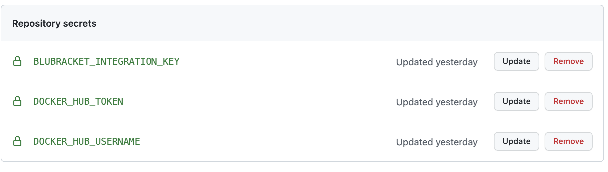
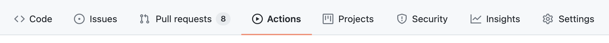
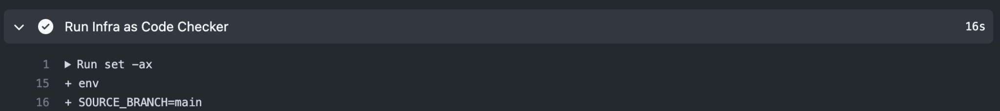
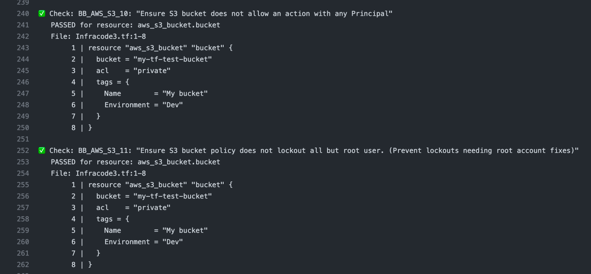
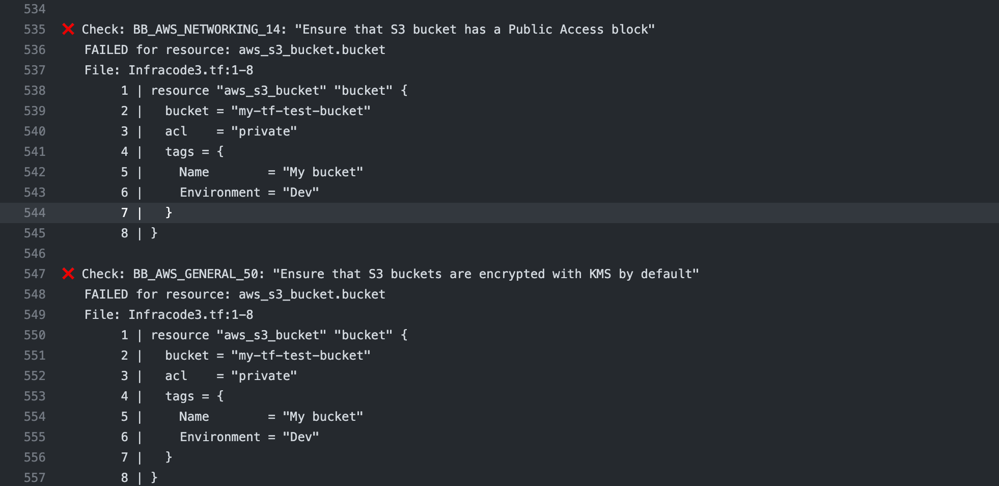

**Step 1: Create GitHub Repository Secrets:**

* Log into GitHub and select a repository where you want to enable Infrastructure as Code scanning.

* Within the repository, select **settings**, then **secrets**

* Create three new repositories secrets

Name: **DOCKER_HUB_USERNAME**

value: blusupport

Name: **DOCKER_HUB_TOKEN**

value: 085ef825-b366-4636-be2a-8babaf65064f

Name: **BLUBRACKET_INTEGRATION_KEY**

value: BluBracket Integration API key

**Steps to create a BluBracket API token:**
[https://support.blubracket.com/hc/en-us/articles/4403018405140-Event-and-Alert-APIs](https://support.blubracket.com/hc/en-us/articles/4403018405140-Event-and-Alert-APIs)



**Step 2: Create Actions Workflow:**

* Within the repository, select Actions and either update an existing ci.yaml script or create a new one



* Add the following script to enable Infrastructure as Code scanning:
  * **Note:** You must update BLUBRACKET_SERVICE_ENDPOINT=https://[Your BluBracket Tenant Name].blubracket.com to your BluBracket tenant name

Example: BLUBRACKET_SERVICE_ENDPOINT=https://acme.blubracket.com

```yaml
# This is a basic workflow to help you get started with Actions


name: CI


# Controls when the workflow will run

on:

  # Triggers the workflow on push or pull request events but only for the main branch

  push:

    branches: [ main ]

  pull_request:

    branches: [ main ]


  # Allows you to run this workflow manually from the Actions tab

  workflow_dispatch:


# A workflow run is made up of one or more jobs that can run sequentially or in parallel

jobs:

  # This workflow contains a single job called "build"

  build:

    # The type of runner that the job will run on

    runs-on: ubuntu-latest


    # Steps represent a sequence of tasks that will be executed as part of the job

    steps:

      # Checks-out your repository under $GITHUB_WORKSPACE, so your job can access it

      - uses: actions/checkout@v2

        with:

          fetch-depth: '0'

      - name: Login to DockerHub

        uses: docker/login-action@v1 

        with:

          username: ${{ secrets.DOCKERHUB_USERNAME }}

          password: ${{ secrets.DOCKERHUB_TOKEN }}

      # Runs a set of commands using the runners shell

      - name: Run Infra as Code Checker
        run: |
          set -ax
          env
          SOURCE_BRANCH=${GITHUB_REF/refs\/heads\//}
          BLUBRACKET_SERVICE_ENDPOINT=https://[BluBracket Tenant Name]
          BLUBRACKET_INTEGRATION_KEY=${{ secrets.BLUBRACKET_INTEGRATION_KEY }}
          docker run -v ${GITHUB_WORKSPACE}:/home/blubracket/iac-checker/repo \
          -u $(id -u):$(id -g) \
          blubracket/iac-checker:0.0.4-beta run \
          --blubracket-service-endpoint ${BLUBRACKET_SERVICE_ENDPOINT} \
          --integration-key ${BLUBRACKET_INTEGRATION_KEY} \
          --source-branch ${GITHUB_HEAD_REF:-${SOURCE_BRANCH}} \
          --target-branch ${GITHUB_BASE_REF:-""} \
          --do-not-fail-on-misconfigurations
```

##### Step 3: Run Workflow

* Ensure workflow runs successfully.   This can be verified by expanding the Run Infra As Code Checker karat:



* If Infrastructure as Code was detected, you will see entries that indicate a check has been performed (green check indicating scan passed, a red “x” indicating a risk has been detected).





* For all detected risks (red “x”), an alert will be posted to the BluBracket portal.
