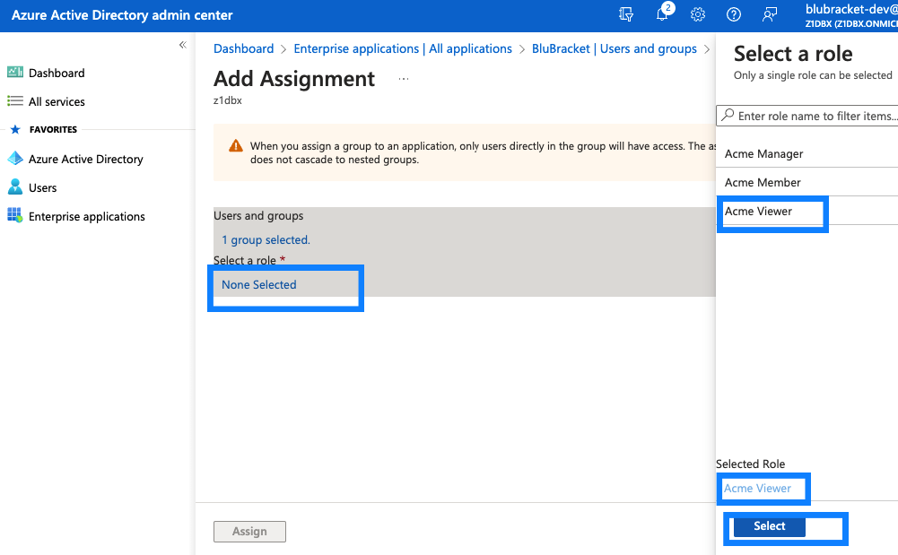

This document will describe how to create and assign roles in Azure AD so that the role can be passed along during SAML login to BluBracket for the purpose of JIT user provisioning. If you are not interested in JIT user provisioning during SAML please skip this document.  Special roles are not required for regular SAML login functionality.

Before proceeding with setting up SAML roles, please ensure that you have configured SAML login on your BluBracket tenant (please see [Configure Azure AD](/how-to/add-user-ad-saml/) for further details).

## Creating a new Applicaiton role in the BluBracket App

The next step is to create a new role for the BluBracket application:

Under Enterprise Applications | BluBracket, select the App roles item.  Then click the Create app role button.

In the Dialog box that appears fill out the following:

* In the **Display name** box, type a name for this role (the name can be anything that seems logical to your organization)
* Under **allowed members types**, select the Both radio button
* In the **Value** field, type a value for the permission we will be granting to this role (the permission can be anything, make not of the value as BluBracket support will later need the value to configure the role mapping)
* In the **Description** box type in any description that will remind you about the purpose of thise role.
* **Do you want to enable this app role** should be selected as enabled.

Once all of the above is filled out, click Apply for the role to be created.

At this point you have created a new custom role for the BluBracket Application. Please remember to send BluBracket Support the value you used above for the Value field as this will essential for BluBracket Support to map your roles to BluBracket roles.

## Adding an Azure group to the BluBracket App

The next step is to add a group to an application, and assign a role to the group.

1. Under **Enterprise Applications** | **BluBracket**, select the **Users and groups** item. Then click on **Add user/group**.
2. Under **users and groups**, click on **None Selected**.
   In the dialog box, search for a pre-existing group which you would like to add to the BluBracket application. (Note that the members of this group will  later be granted permission to login to BluBracket via SAML).
   Once you have found the group click on that group, and then click on the **Select** button to confirm the selection.
3. Next, under Select a role, select the None Selected.
   In the dialog box that appears find the name of the application role that you had created previously in this document.
   Select that role.
   Then click on the **Select** button to confirm the selection.
4. Finally Select the **Assign** button to complete the assingment of this group and role to the BluBracket application.

At this point you have completed assigning a new group, with the given role assigned to the BluBracket Application.
