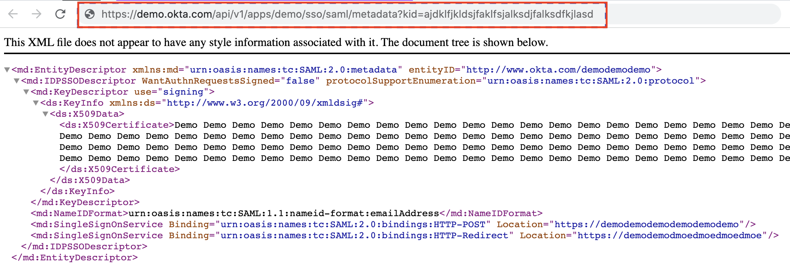

BluBracket supports single sign-on and federated identity services with Okta using SAML. This article covers configuring the BluBracket app in Okta, configuring the Okta SAML federation in BluBracket, and managing users.

Once single sign-on is configured as described below, authentication, passwords, and two-factor authentication are managed and configured in Okta.

However unless [role based access](/how-to/role-based-access-control/) is enabled, users must be registered in both BluBracket and Okta. Removing a user from either Okta or BluBracket will terminate their access to BluBracket. Additionally, the email address for each user in BluBracket must match the email address in Okta.

BluBracket requires an email attribute in order to successful identify and authenticate users; BluBracket looks for this value from the SAML identity claim `http://schemas.xmlsoap.org/ws/2005/05/identity/claims/emailaddress`.

### Register the BluBracket app in Okta

1. Login to Okta as an Administrator

2. Select the Applications nav on the left and click "Create App Integration"
  

3. Select SAML 2.0 and click next
  

4. Input a name for your app and click next
  

5. Input the following fields and click next:
    - Single sign-on URL: `https://your-account-name.blubracket.com/api/saml/sso` (**be sure to replace** `your-account-name`)

    - Use this for Recipient URL and Destination URL: `True`

    - Audience URI: `https://your-account-name.blubracket.com/entityId` (**be sure to replace** `your-account-name`)

    - Name ID format: `EmailAddress`

    - Application username: `Okta username`
   

6. Select the following fields and click next:
    - I'm an Okta customer adding an internal app
    - This is an internal app that we have created
  

7. Click the Sign On tab and under SAML Signing Certificates and under SHA-2 click the actions button and then "View IdP metadata".
  

8. Copy the url in your browser
  

### Register the Okta configuration within BluBracket

In BluBracket, click the settings icon on the left nav, then click the SSO & Identity Management in the settings nav and paste the url into the input. Finally, click outside of the input for the settings to take effect.
  

### Add users in BluBracket

Tenant administrators must add users to their BluBracket tenant prior to login via single sign-on. [Full details are here](/how-to/add-user/).

### Test the Okta/SAML configuration

Open `https://your-account-name.blubracket.com` in a new private browser window or open a different browser to test the Single Sign-on changes (Be sure to replace `your-account-name` with the name of your account name provided by BluBracket). The login page should automatically redirect to Okta, if Okta authentication is successful, the user will then be redirected back to BluBracket and logged into the tenant.
