BluBracket supports single sign-on and federated identity services with Ping using SAML. This article covers configuring the BluBracket app in Ping, configuring the Ping SAML federation in BluBracket, and managing users.

Once single sign-on is configured as described below, authentication, passwords, and two-factor authentication are managed and configured in Ping.

However unless [role based access](/how-to/role-based-access-control/) is enabled, users must be registered in both BluBracket and Ping. Removing a user from either Ping or BluBracket will terminate their access to BluBracket. Additionally, the email address for each user in BluBracket must match the email address in Ping.

BluBracket requires an email attribute in order to successful identify and authenticate users; BluBracket looks for this value from the SAML identity claim `http://schemas.xmlsoap.org/ws/2005/05/identity/claims/emailaddress`.

### Register the BluBracket app in Ping

1. Login to Ping as an Administrator

2. Click Connections
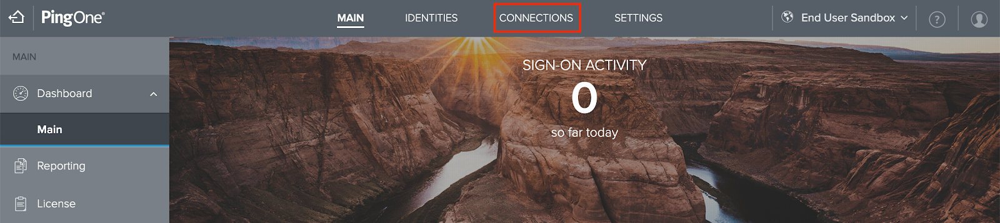

3. Click + Add Application
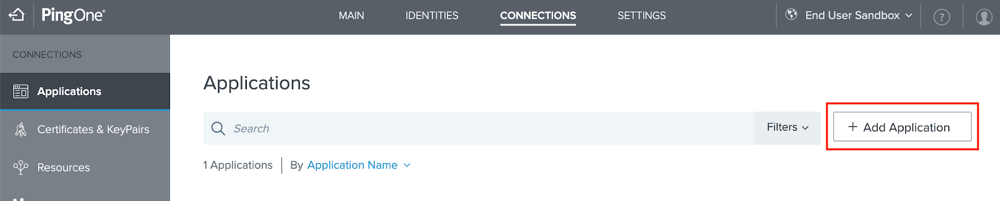

4. Click the Web App application type
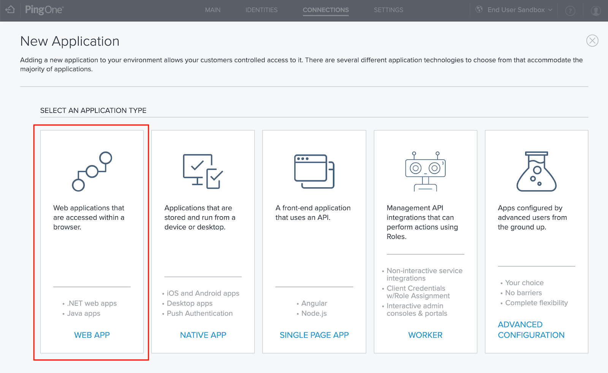

5. Choose configure SAML
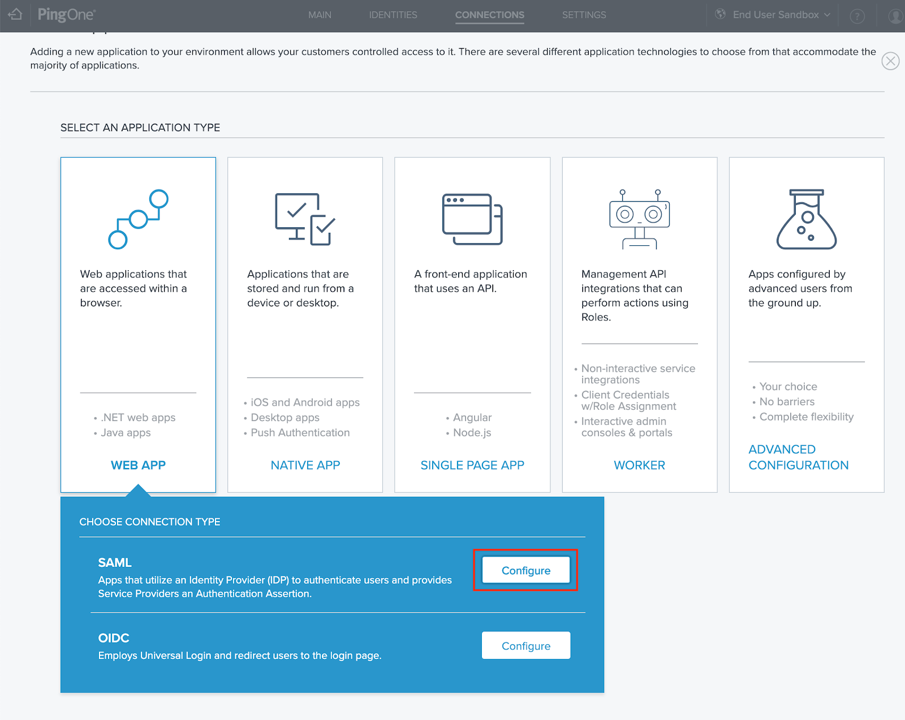

6. Add the company name and click next
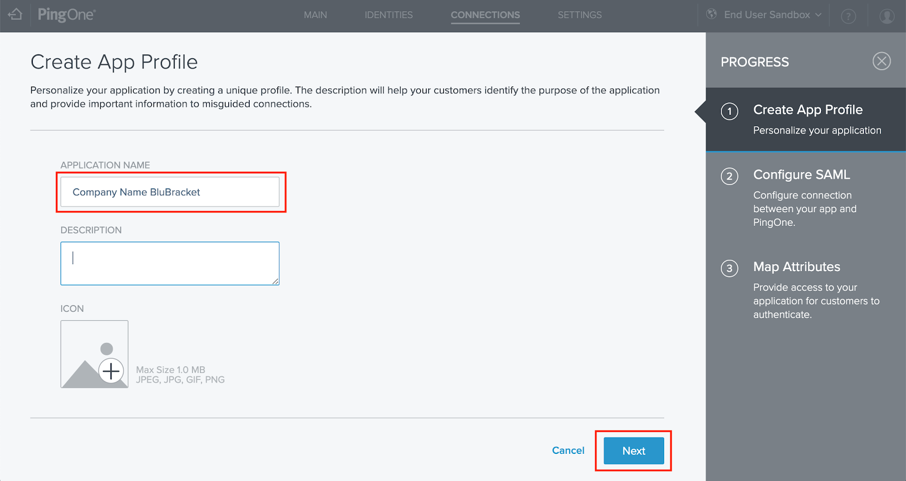

7. Enter the ACS url for your account:
    - `https://your-account-name.blubracket.com/api/saml/sso` (**be sure to replace** `your-account-name`)

8. Scroll down and input the following fields and then click save and continue:
    - Entity Id: `https://your-account-name.blubracket.com/entityId` (**be sure to replace** `your-account-name`)

    - Assertion Validity Duration: `3600`

    - Target Application URL: `https://your-account-name.blubracket.com` (**be sure to replace** `your-account-name`)
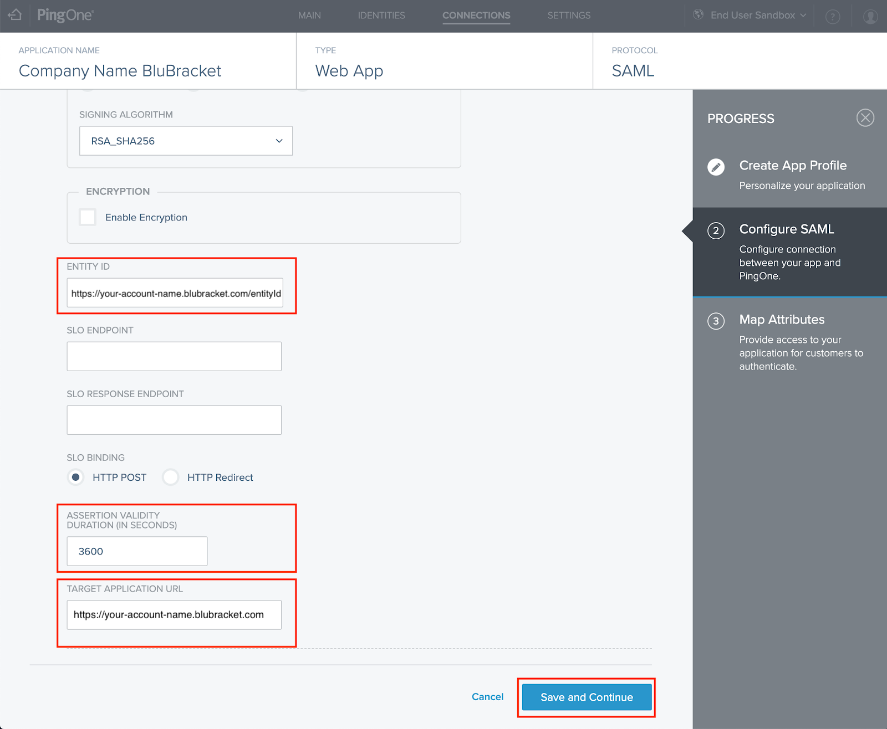

9. Under Attribute Mapping choose Username and click Save and Close
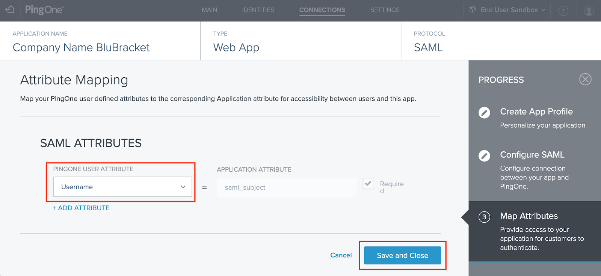

10. Toggle the new app as active
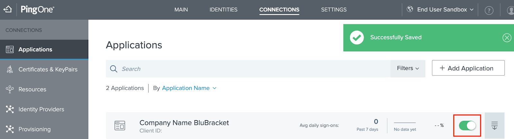

11. Add users
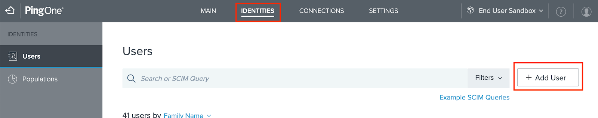

12. In the new application, click Compliance and copy the IDP Metadata URL listed
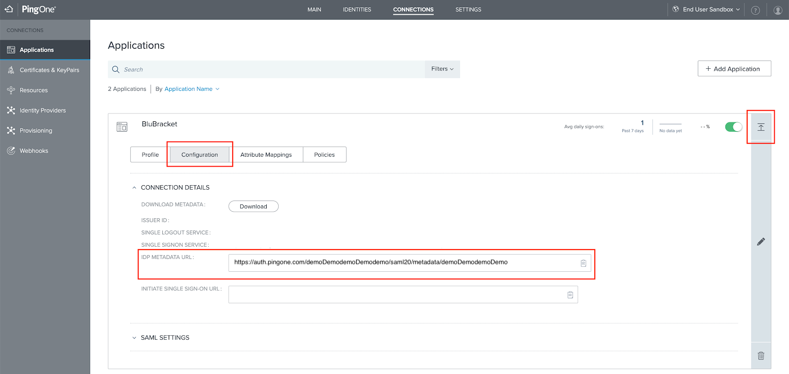

### Register the Ping configuration within BluBracket

In BluBracket, click the settings icon on the left nav, then click the SSO & Identity Management in the settings nav and paste the url into the input. Finally, click outside of the input for the settings to take effect.
  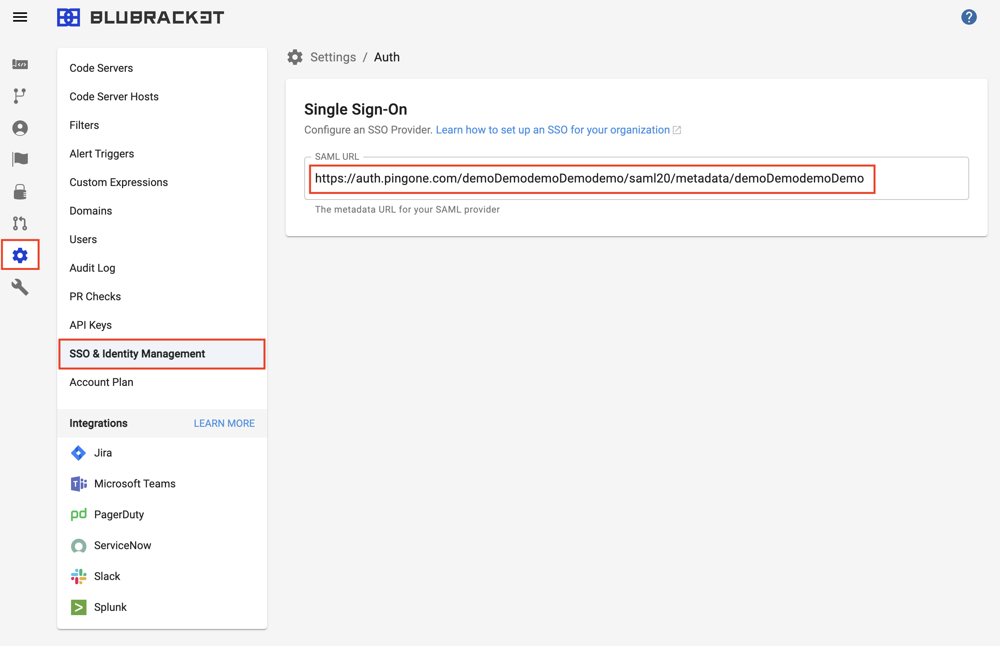

### Add users in BluBracket

Tenant administrators must add users to their BluBracket tenant prior to login via single sign-on. [Full details are here](/how-to/add-user/).

### Test the Ping/SAML configuration

Open `https://your-account-name.blubracket.com` in a new private browser window or open a different browser to test the Single Sign-on changes (Be sure to replace `your-account-name` with the name of your account name provided by BluBracket). The login page should automatically redirect to Ping, if Ping authentication is successful, the user will then be redirected back to BluBracket and logged into the tenant.

Troubleshooting: use `https://your-account-name.blubracket.com/login?force=true` to login via local authentication
