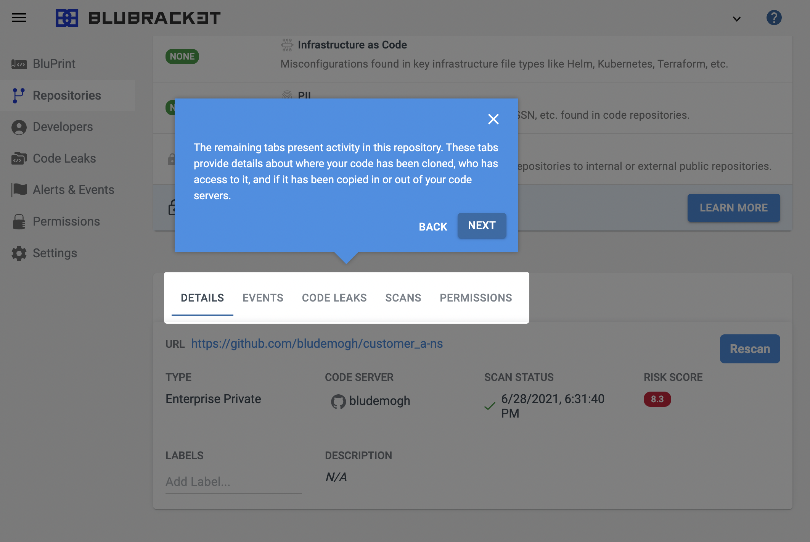
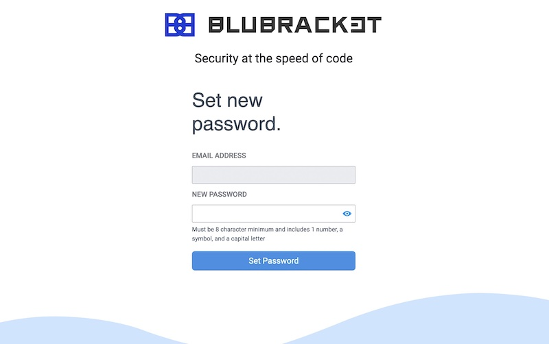
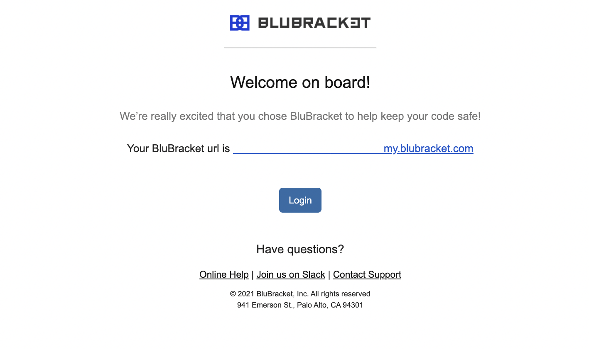
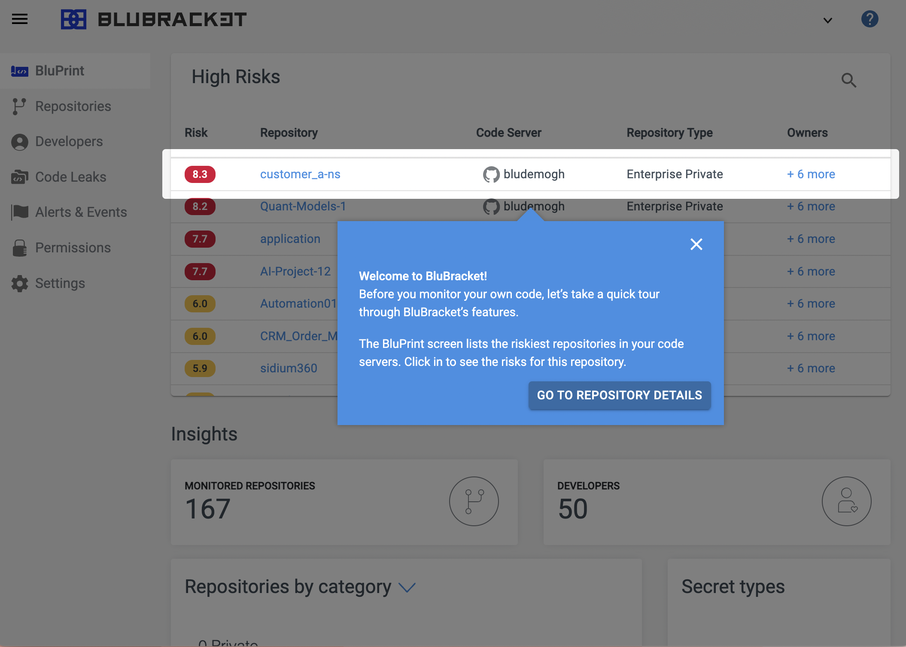

Getting started with BluBracket is a three step process: sign up, add a code server, then start improving security. Using our scanning tool, you you find the risks in your code and dig deeper into the information provided.

Once you have signed up, you can immediately start scanning repositories and commits for vulnerabilities.

If you are ready to improve your code's security, please read below to get started for free.

## Signing up with BluBracket

To create a user account, visit [https://blubracket.com/contact/get-started/](https://blubracket.com/contact/get-started/). Click the **Start for Free** button.

Enter your email. Then, click the **Start Trial** button.

Once you have submitted your email, you should receive a confirmation page that asks you to check your email for your login link.  

### Check your email

Next, check your email for a link to confirm your account and create a password.

In your email, you will find the following link. Click the **Set Password** button to set the password of your BluBracket login account.

NOTE: This password request expires in 48 hours.

Once you have set your password, you are ready to get started with connecting your repositories to BluBracket.

### Set your password

Fill in your email address and password.

**Password Criteria**:

- Passwords must be at least eight characters.
- Passwords must include at least one number, a special character or symbol, and one uppercase letter.

## Signing in

Refer to your welcome email when you first signed in to BluBracket for your personalized dashboard URL. You must use this URL in order to sign in.

## Adding your first code server

Go to Settings > Code Servers in the BluBracket web console to add one or more code repositories hosted on GitHub, GitLab, Bitbucket, or another supported code server.

Full details about [how to add a code server are available in the usage guide](https://docs.blubracket.com/how-to/add-code-servers/).

## Improve your code security with every commit

1. Add BluBracket to your workflow with the CLI tool, [GitHub Checks (or other CI checks)](https://github.com/BluBracket/docs.blubracket.com) so you can identify risks before your next commit.
2. Review [existing risks](https://docs.blubracket.com/intro/key-workflows/#understanding-and-taking-action-on-existing-risks) to understand your overall code health and make a plan for what is urgent and what can wait.
3. Track your security health improvements with every commit.
