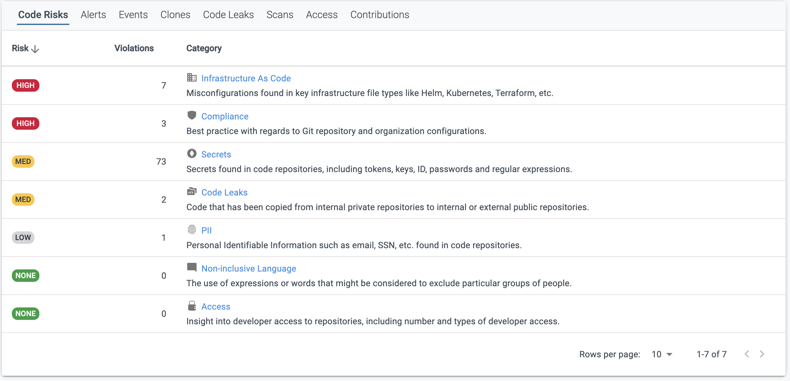

### New Features and Enhancements

### Enterprise Edition

New Code Risks Categories

BluBracket has added two additional Risk Categories to the repo detail view, PII and Non-inclusive language!

All newly created tenants will automatically have three Non-inclusive language regular expressions configured (blacklist, slave, master) and one PII regular expression for social security numbers.

For existing customers, if you would like to utilize the new PII and Non-inclusive Language categories, please follow the instructions below:

1.  Login to the BluBracket portal and select Settings, then Code Scanning

2.  Under Custom Expression, select ADD REGEX

3.  For Non-inclusive Language, create the following regular expressions:

* Description: Non-inclusive Language - Master
    Expression: \\b(?i)(master)\\b
    Example: Master

* Description: Non-inclusive Language - Slave
    Expression: \\b(?i)(slave)\\b
    Example: Slave

* Description: Non-inclusive Language - Blacklist
    Expression: \\b(?i)(blacklist(ed|ing){0,1})\\b
    Example: Blacklist

4\. For PII, create the following regular expressions:

* Description: PII - SSN
    Expression: \\b(?P&lt;ssn1&gt;\\d{3})-(?P&lt;ssn2&gt;\\d{2})-(?P&lt;ssn3&gt;\\d{4})\\b
    Example: 123-45-6789

Note: you are able to add any additional custom regular expressions, but in order for them to appear in the PII or Non-inclusive Language categories, you must prepend each custom expression Description with either PII - \[any value\] or Non-inclusive Language - \[any value\] (Note: the filter is case sensitive, so you must capitalize as the examples appear).

Example for adding a custom non-inclusive language for the term “whitelist”.

* Description: Non-inclusive Language - Whitelist
    Expression: \\b(?i)(whitelist(ed|ing){0,1})\\b
    Example: Whitelist

In addition to the above, an enhancement was made to rename Code Copies to Code Leaks

### Free Trial Edition

The Enterprise Edition features and bug fixes listed in these release notes also apply to the Free Trial Edition.

### Bug Fixes

* CORE-7654 - Fix regular expression fields from disappearing in UI view until page was refreshed when an edit was made

* CORE-7659 - Fix routing issue with PagerDuty integration

* CORE-7693 - Fix API Key “Last Used” column showing no value

### Critical Notifications

* **Unsupported Languages**

  * Note that BluBracket is not currently able to identify and alert on secrets in languages that do not use traditional assignment operators (Lisp, Scheme and Clojure for example).

* **GitHub Payload Cap**

  * GitHub payloads are capped at 25 MB. If your event generates a larger payload, a webhook will not be fired which means that BluBracket will not be able to identify the event. This may happen, for example, on a create event if many branches or tags are pushed at once. We suggest monitoring your payload size to ensure delivery. Please refer to the following GitHub document: [https://developer.github.com/webhooks/#payloads](https://developer.github.com/webhooks/#payloads).
