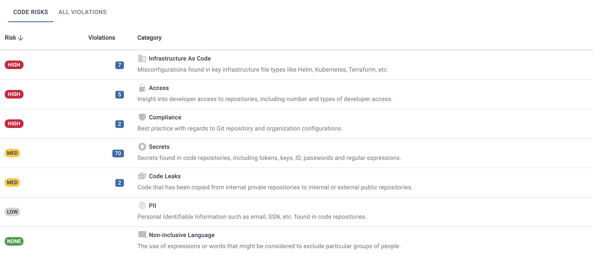

### New Features and Enhancements

* **New Repo Details Design**. When clicking on a Repository, you will now see a new design that lists the risk rating and number of violations for each risk category. Clicking on the violations number will provide a filter view of all violations of that risk category type.

    

* The terminology “Alerts” has been replaced with “All Violations”, which is a new tab next to Code Risks at top of screen.

* New Product Tour when first on-boarding or logging in to the latest version

* CSV download now available when clicking on a risk category Violation count link

* Two new public API’s have been released

  * /api/public/blubracket-ignore

    * blubracket-ignore is an API that can be used to globally ignore secret types or secret values. For example, you may want to ignore any passwords that have the value of “password”. Ignore means an event will be created, but not an alert for that secret.

  * /api/public/repo/scan_status

    * scan_status is an API that can be used to the scan status of a specified repository

### Free Trial Edition

The Enterprise Edition features and bug fixes listed in these release notes also apply to the Free Trial Edition.

### Bug Fixes

* CORE-7770-Repos not showing up right away in Monitored Repo Select Screen

* CORE-7853- Filter for selecting unmonitored repos not display results

* CORE-7923 - Fixed several multi-select navigation issues

* CORE-7743 - Fix filtering by developer and type returns 0 results
